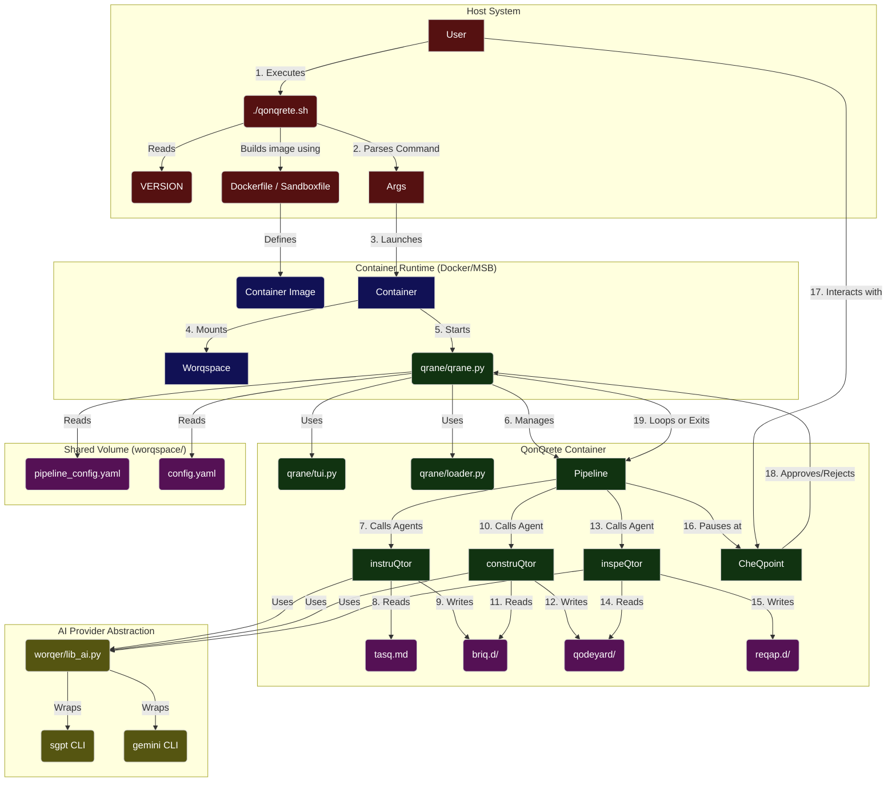

# QonQrete System Architecture

This document contains a Mermaid diagram illustrating the complete architecture of the QonQrete system, from user interaction to agent execution.

```mermaid
graph TD
    subgraph Host System
        User -- 1. Executes --> Shell(./qonqrete.sh);
        Shell -- Reads --> VersionFile(VERSION);
        Shell -- Builds image using --> BuildFiles(Dockerfile / Sandboxfile);
        Shell -- 2. Parses Command --> Args;
    end

    subgraph "Container Runtime (Docker/MSB)"
        BuildFiles -- Defines --> Image(Container Image);
        Args -- 3. Launches --> Container;
        Container -- 4. Mounts --> Worqspace;
        Container -- 5. Starts --> Qrane;
    end

    subgraph "QonQrete Container"
        Qrane(qrane/qrane.py) -- Uses --> TUI(qrane/tui.py);
        Qrane -- Uses --> Loader(qrane/loader.py);
        Qrane -- 6. Manages --> Pipeline;
        Pipeline -- 7. Calls Agents --> instruQtor;
        instruQtor -- 8. Reads --> TasQ;
        instruQtor -- 9. Writes --> BriQs;
        Pipeline -- 10. Calls Agent --> construQtor;
        construQtor -- 11. Reads --> BriQs;
        construQtor -- 12. Writes --> Qodeyard;
        Pipeline -- 13. Calls Agent --> inspeQtor;
        inspeQtor -- 14. Reads --> Qodeyard;
        inspeQtor -- 15. Writes --> ReQap;
        Pipeline -- 16. Pauses at --> CheQpoint;
    end

    subgraph "Shared Volume (worqspace/)"
        Worqspace;
        Qrane -- Reads --> PConfig(pipeline_config.yaml);
        Qrane -- Reads --> Config(config.yaml);
        TasQ(tasq.md);
        BriQs(briq.d/);
        Qodeyard(qodeyard/);
        ReQap(reqap.d/);
    end

    subgraph "AI Provider Abstraction"
        LibAI(worqer/lib_ai.py);
        instruQtor -- Uses --> LibAI;
        construQtor -- Uses --> LibAI;
        inspeQtor -- Uses --> LibAI;
        LibAI -- Wraps --> SGPT(sgpt CLI);
        LibAI -- Wraps --> Gemini(gemini CLI);
    end

    User -- 17. Interacts with --> CheQpoint;
    CheQpoint -- 18. Approves/Rejects --> Qrane;
    Qrane -- 19. Loops or Exits --> Pipeline;

    classDef host fill:#511,stroke:#ccc,color:#fff;
    classDef container fill:#115,stroke:#ccc,color:#fff;
    classDef qonqrete fill:#131,stroke:#ccc,color:#fff;
    classDef volume fill:#515,stroke:#ccc,color:#fff;
    classDef abstraction fill:#551,stroke:#ccc,color:#fff;

    class User,Shell,Args,VersionFile,BuildFiles host;
    class Container,Worqspace,Image container;
    class Qrane,Pipeline,instruQtor,construQtor,inspeQtor,CheQpoint,TUI,Loader qonqrete;
    class TasQ,BriQs,Qodeyard,ReQap,Config,PConfig volume;
    class LibAI,SGPT,Gemini abstraction;
```
