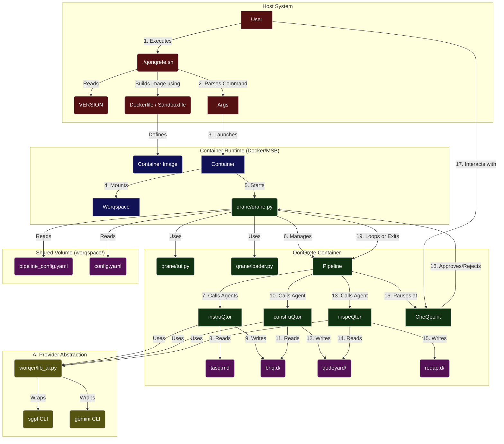

# QonQrete Documentation

**Version:** `v0.2.3-alpha` (See `VERSION` file for the canonical version).

This document provides a comprehensive overview of the QonQrete Secure AI Construction Loop System.

## Table of Contents
- [Architecture](#architecture)
- [Execution Flows](#execution-flows)
- [Agent & Orchestrator Logic](#agent--orchestrator-logic)
- [Configuration](#configuration)
- [Getting Started](#getting-started)
- [Terminology](#terminology)

## Architecture

This section contains a Mermaid diagram illustrating the complete architecture of the QonQrete system, from user interaction to agent execution.

---

## Execution Flows

This section traces the end-to-end execution flows of the QonQrete system, from user command to the completion of a cycle.

### 1. Initialization Flow (`./qonqrete.sh init`)

1.  **User Input**: User executes `./qonqrete.sh init`. An optional `--msb` or `--docker` flag can be provided.
2.  **`qonqrete.sh`**: The script parses the `init` command.
3.  **Runtime Detection**: It checks for the `--msb` or `--docker` flags. If none are provided, it checks `pipeline_config.yaml` for a `microsandbox: true` setting. If not found, it defaults to Docker.
4.  **Container Build**:
    *   If the runtime is `docker`, it executes `docker build -t qonqrete-qage -f Dockerfile .`.
    *   If the runtime is `msb`, it executes `msb build . -t qonqrete-qage` (or `mbx`).
5.  **Result**: A container image named `qonqrete-qage` is created in the local registry of the selected runtime, ready for execution.

### 2. Main Execution Flow (`./qonqrete.sh run`)

1.  **User Input**: User executes `./qonqrete.sh run`. Optional flags like `--auto` and `--tui` can be included.
2.  **`qonqrete.sh`**:
    *   Parses the `run` command and any additional flags.
    *   Verifies that `OPENAI_API_KEY` and `GOOGLE_API_KEY` are exported in the shell.
    *   Reads the `VERSION` file and exports it as `QONQ_VERSION`.
    *   Creates a unique timestamped run directory inside `worqspace/`.
    *   Copies configuration files and the initial `tasq.md` into this new run directory.
    *   Constructs the `docker run` or `msb run` command, mounting volumes and passing API keys.
3.  **`qrane.py` (Inside the Container)**:
    *   The orchestrator starts, determines UI mode (TUI/headless), and enters the main `cyQle` loop.
4.  **The `cyQle` Loop**:
    *   The `Qrane` dynamically loads the agent pipeline from `pipeline_config.yaml`.
    *   It executes each agent in sequence, passing the correct input/output paths.
5.  **The `CheQpoint`**:
    *   `qrane.py` reads the final `reQap.md` of the cycle.
    *   It pauses and prompts the user for input (`[Q]ontinue`, `[T]weaQ`, `[X]Quit`), unless in `--auto` mode.
6.  **Loop Continuation**:
    *   If approved, the `reQap.md` is promoted to become the task for the next cycle.
    *   The cycle counter increments, and the loop repeats.
7.  **Exit**: If the user quits, the loop breaks, the container exits, and the script finishes.

### 3. Cleanup Flow (`./qonqrete.sh clean`)

1.  **User Input**: User executes `./qonqrete.sh clean`.
2.  **`qonqrete.sh`**:
    *   Searches for `qage_*` directories in `worqspace/`.
    *   Prompts the user for confirmation.
    *   If confirmed, it executes `rm -rf worqspace/qage_*`.
3.  **Result**: The `worqspace` is cleared of all previous run data.

---

## Agent & Orchestrator Logic

This section details the operational logic for the QonQrete system.

### Orchestrator Logic (`qrane/qrane.py`)

The `Qrane` is the heart of the system. As of `v0.2.2-alpha`, it functions as a dynamic pipeline runner.

-   **Dynamic Pipeline Loading**: On startup, the `Qrane` reads the `worqspace/pipeline_config.yaml` file. It iterates through the `agents` list defined in this file to build the execution pipeline for the cycle.
-   **Generic Execution**: For each agent in the pipeline, the orchestrator constructs the appropriate command-line arguments based on the `script`, `input`, and `output` fields in the config.
-   **Centralized Paths**: It utilizes the `PathManager` class to resolve all file and directory paths.
-   **Pre-flight Checks**: Before starting the cycle, it performs a check to ensure that all required CLI tools are available.

### Default Agent Logic

The following describes the logic of the three default agents that constitute the standard QonQrete pipeline.

#### Core Abstraction: `worqer/lib_ai.py`

All agents utilize this central library to interact with AI models by wrapping their respective CLI tools (`sgpt`, `gemini`). This design makes adding new providers highly modular.

#### 1. `instruQtor` (The Planner)
-   **Purpose**: To decompose a high-level task (`tasQ.md`) into a series of small, actionable steps (`briQ.md` files).
-   **Logic**: It reads the task, constructs a detailed prompt for the AI, invokes the AI via `lib_ai.py`, and then parses the markdown response into individual `briQ.md` files.

#### 2. `construQtor` (The Executor)
-   **Purpose**: To execute the steps from the `briQ.md` files and generate code.
-   **Logic**: It iterates through the `briQ` files sequentially. For each, it builds a prompt that includes the step's instructions and the current state of the `qodeyard` directory. It then calls the AI to execute the step.

#### 3. `inspeQtor` (The Reviewer)
-   **Purpose**: To review the `construQtor`'s work and provide feedback for the next cycle.
-   **Logic**: It gathers all generated code from the `qodeyard`, constructs a prompt instructing the AI to act as a senior code reviewer, and saves the AI's assessment and suggestions to a `reQap.md` file.

---

## Configuration

The behavior of the QonQrete system can be configured in the `worqspace/` directory.

-   **`config.yaml`**:
    -   **`auto_cycle_limit`**: The maximum number of `cyQle`s to run in autonomous mode. `0` means infinite.
    -   **`agents`**: The AI models to be used by each agent.
-   **`pipeline_config.yaml`**:
    -   **`microsandbox`**: Set to `true` to make Microsandbox (`msb`) the default container runtime.
    -   **`agents`**: Defines the sequence of agents in the pipeline.

## Getting Started

To get started with QonQrete, please see the **[QUICKSTART.md](./QUICKSTART.md)** guide.

## Terminology

For a complete list of the terminology used in the QonQrete system, please see the **[TERMINOLOGY.md](./TERMINOLOGY.md)** file.