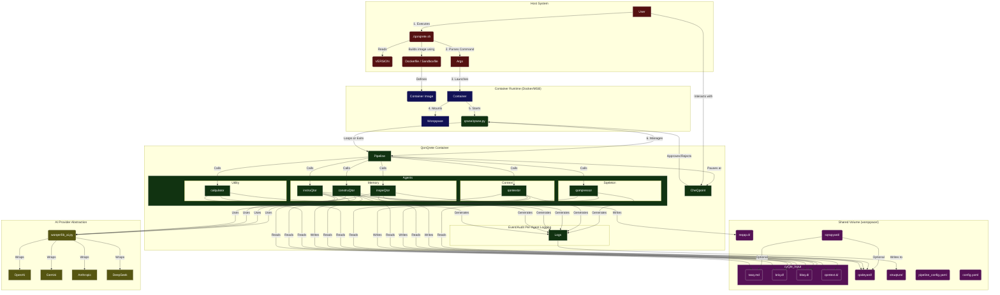

# QonQrete Documentation

**Version:** `v0.6.0-beta` (See `VERSION` file for the canonical version).

This document provides a comprehensive overview of the QonQrete Secure AI Construction Loop System.

## Table of Contents
- [Architecture](#architecture)
- [Execution Flows](#execution-flows)
- [Agent & Orchestrator Logic](#agent--orchestrator-logic)
- [Configuration](#configuration)
- [Getting Started](#getting-started)
- [Terminology](#terminology)

## Architecture

This section contains a Mermaid diagram illustrating the complete architecture of the QonQrete system, from user interaction to agent execution.

```mermaid
graph TD
    subgraph Host System
        User -- 1. Executes --> Shell(./qonqrete.sh);
        Shell -- Reads --> VersionFile(VERSION);
        Shell -- Builds image using --> BuildFiles(Dockerfile / Sandboxfile);
        Shell -- 2. Parses Command --> Args;
    end

    subgraph "Container Runtime (Docker/MSB)"
        BuildFiles -- Defines --> Image(Container Image);
        Args -- 3. Launches --> Container;
        Container -- 4. Mounts --> Worqspace;
        Container -- 5. Starts --> Qrane;
    end

    subgraph "QonQrete Container"
        direction LR
        Qrane(qrane/qrane.py) -- 6. Manages --> Pipeline;
        
        subgraph "Agents"
            direction TB
            
            subgraph "Sqeleton"
                qompressor;
            end

            subgraph "Context"
                qontextor;
            end

            subgraph "Memory"
                instruQtor;
                construQtor;
                inspeQtor;
            end

            subgraph "Utility"
                calqulator;
            end
        end
        
        subgraph "Event/Audit Per-Agent Logging"
            direction TB
            LogNode[Logs];
            qompressor -- Generates --> LogNode;
            qontextor -- Generates --> LogNode;
            instruQtor -- Generates --> LogNode;
            construQtor -- Generates --> LogNode;
            inspeQtor -- Generates --> LogNode;
            calqulator -- Generates --> LogNode;
        end

        Pipeline -- Calls --> qompressor;
        Pipeline -- Calls --> qontextor;
        Pipeline -- Calls --> instruQtor;
        Pipeline -- Calls --> construQtor;
        Pipeline -- Calls --> inspeQtor;
        Pipeline -- Calls --> calqulator;
        
        Pipeline -- Pauses at --> CheQpoint;

    end

    subgraph "Shared Volume (worqspace/)"
        Worqspace;
        
        subgraph cyQle_Input
            direction LR
            TasQ(tasq.md);
            BriQs(briq.d/);
            Bloq(bloq.d/);
            Qontext(qontext.d/);
        end
        
        Qodeyard(qodeyard/);
        ReQap(reqap.d/);
        Struqture(struqture/);
        Sqrapyard(sqrapyard/);
        
        PConfig(pipeline_config.yaml);
        Config(config.yaml);
        
        Sqrapyard -- Optional --> Qodeyard;
        Sqrapyard -- Optional --> TasQ;
    end

    subgraph "AI Provider Abstraction"
        LibAI(worqer/lib_ai.py);
        instruQtor -- Uses --> LibAI;
        construQtor -- Uses --> LibAI;
        inspeQtor -- Uses --> LibAI;
        qontextor -- Uses --> LibAI;
        LibAI -- Wraps --> OpenAI;
        LibAI -- Wraps --> Gemini;
        LibAI -- Wraps --> Anthropic;
        LibAI -- Wraps --> DeepSeek;
    end

    User -- Interacts with --> CheQpoint;
    CheQpoint -- Approves/Rejects --> Qrane;
    Qrane -- Loops or Exits --> Pipeline;

    instruQtor -- Reads --> TasQ;
    instruQtor -- Writes --> BriQs;
    
    qompressor -- Reads --> Qodeyard;
    qompressor -- Writes --> Bloq;

    qontextor -- Reads --> Bloq;
    qontextor -- Writes --> Qontext;
    
    calqulator -- Reads --> BriQs;
    calqulator -- Reads --> Bloq;

    construQtor -- Reads --> BriQs;
    construQtor -- Reads --> Bloq;
    construQtor -- Reads --> Qontext;
    construQtor -- Writes --> Qodeyard;

    inspeQtor -- Reads --> Qodeyard;
    inspeQtor -- Writes --> ReQap;

    LogNode -- Writes to --> Struqture;

    classDef host fill:#511,stroke:#ccc,color:#fff;
    classDef container fill:#115,stroke:#ccc,color:#fff;
    classDef qonqrete fill:#131,stroke:#ccc,color:#fff;
    classDef volume fill:#515,stroke:#ccc,color:#fff;
    classDef abstraction fill:#551,stroke:#ccc,color:#fff;

    class User,Shell,Args,VersionFile,BuildFiles host;
    class Container,Worqspace,Image container;
    class Qrane,Pipeline,instruQtor,construQtor,inspeQtor,qompressor,qontextor,calqulator,CheQpoint,TUI,Loader,Agents,LogNode qonqrete;
    class TasQ,BriQs,Qodeyard,ReQap,Config,PConfig,Sqrapyard,Bloq,Qontext,Struqture,cyQle_Input volume;
    class LibAI,OpenAI,Gemini,Anthropic,DeepSeek abstraction;
```

---

## Execution Flows

This section traces the end-to-end execution flows of the QonQrete system, from user command to the completion of a cycle.

### 1. Initialization Flow (`./qonqrete.sh init`)

1.  **User Input**: User executes `./qonqrete.sh init`. An optional `--msb` or `--docker` flag can be provided.
2.  **`qonqrete.sh`**: The script parses the `init` command.
3.  **Runtime Detection**: It checks for the `--msb` or `--docker` flags. If none are provided, it checks `pipeline_config.yaml` for a `microsandbox: true` setting. If not found, it defaults to Docker.
4.  **Container Build**:
    *   If the runtime is `docker`, it executes `docker build -t qonqrete-qage -f Dockerfile .`.
    *   If the runtime is `msb`, it executes `msb build . -t qonqrete-qage` (or `mbx`).
5.  **Result**: A container image named `qonqrete-qage` is created in the local registry of the selected runtime, ready for execution.

### 2. Main Execution Flow (`./qonqrete.sh run`)

1.  **User Input**: User executes `./qonqrete.sh run`. Optional flags like `--auto`, `--user`, and `--tui` can be included.
2.  **`qonqrete.sh`**:
    *   Parses the `run` command and any additional flags.
    *   Reads the `VERSION` file and exports it as `QONQ_VERSION`.
    *   Creates a unique timestamped run directory (`qage_<timestamp>`) inside `worqspace/`.
    *   **Sqrapyard Initialization**: It checks the persistent `worqspace/sqrapyard` directory. If it contains files, they are copied into the new `qage_<timestamp>/qodeyard`. If `sqrapyard/tasq.md` exists, it's copied to become the initial tasq for the first cycle.
    *   Copies configuration files into the new run directory.
    *   Constructs the `docker run` or `msb run` command, mounting the `qage_<timestamp>` directory and passing the necessary environment variables.
3.  **`qrane.py` (Inside the Container)**:
    *   The orchestrator starts.
    *   **API Key Validation**: It reads `config.yaml` to identify all unique AI providers being used for the current run. It then checks that the corresponding environment variables (e.g., `OPENAI_API_KEY`, `DEEPSEEK_API_KEY`) are set. If a required key for a configured provider is missing, it exits with a clear error message.
    *   It determines the UI mode (TUI/headless) and enters the main `cyQle` loop.
4.  **The `cyQle` Loop**:
    *   The `Qrane` dynamically loads the agent pipeline from `pipeline_config.yaml`.
    *   It executes each agent in sequence.
5.  **The `CheQpoint`**:
    *   `qrane.py` reads the final `reQap.md` of the cycle.
    .   It pauses and prompts the user for input (`[Q]ontinue`, `[T]weaQ`, `[X]Quit`), unless in autonomous mode. The default behavior (autonomous vs. user-gated) is controlled by the `cheqpoint` option in `config.yaml`, and can be overridden by the `--auto` or `--user` flags.
6.  **Loop Continuation**:
    *   If approved, the `reQap.md` is promoted to become the task for the next cycle.
    *   The cycle counter increments, and the loop repeats.
7.  **Exit**: If the user quits, the loop breaks, the container exits, and the script finishes.

### 3. Cleanup Flow (`./qonqrete.sh clean`)

1.  **User Input**: User executes `./qonqrete.sh clean`.
2.  **`qonqrete.sh`**:
    *   Searches for `qage_*` directories in `worqspace/`.
    *   Prompts the user for confirmation.
    *   If confirmed, it executes `rm -rf worqspace/qage_*`.
3.  **Result**: The `worqspace` is cleared of all previous run data.

---

## Agent & Orchestrator Logic

This section details the operational logic for the QonQrete system.

### Orchestrator Logic (`qrane/qrane.py`)

The `Qrane` is the heart of the system.

-   **Dynamic Pipeline Loading**: On startup, the `Qrane` reads the `worqspace/pipeline_config.yaml` file. It iterates through the `agents` list defined in this file to build the execution pipeline for the cycle.
-   **Generic Execution**: For each agent in the pipeline, the orchestrator constructs the appropriate command-line arguments based on the `script`, `input`, and `output` fields in the config.
-   **Centralized Paths**: It utilizes the `PathManager` class to resolve all file and directory paths.

### Default Agent Logic

The following describes the logic of the three default agents that constitute the standard QonQrete pipeline.

#### Core Abstraction: `worqer/lib_ai.py`

All agents utilize this central library to interact with AI models. It uses a hybrid approach:
- **Official Python Libraries**: Used for OpenAI, Google Gemini, and Anthropic. These libraries read their respective API keys (`OPENAI_API_KEY`, `GOOGLE_API_KEY`, `ANTHROPIC_API_KEY`) directly from the environment.
- **Custom Provider**: A custom, OpenAI-compatible provider located in `sqeleton/deepseek_provider.py` is used for DeepSeek. This method is more reliable and uses the `DEEPSEEK_API_KEY` from the environment.

This provides a consistent and modular interface for all AI interactions.

#### 1. `instruQtor` (The Planner)
-   **Purpose**: To decompose a high-level task (`tasQ.md`) into a series of small, actionable steps (`briQ.md` files).
-   **Logic**: It reads the task, constructs a detailed prompt for the AI, invokes the AI via `lib_ai.py`, and then parses the markdown response into individual `briQ.md` files.
-   **Sensitivity**: The level of detail in the breakdown can be controlled with the `QONQ_SENSITIVITY` environment variable, which corresponds to 10 predefined levels (0-9).
-   **Context-Aware**: It reads the contents of the `qodeyard` to provide the AI with the current state of the codebase.

#### 2. `construQtor` (The Executor)
-   **Purpose**: To execute the steps from the `briQ.md` files and generate code.
-   **Logic**: It iterates through the `briQ` files sequentially. For each, it builds a prompt that includes the step's instructions and the current state of the `qodeyard` directory. It then calls the AI to execute the step and writes the generated code to the `qodeyard`.

#### 3. `inspeQtor` (The Reviewer)
-   **Purpose**: To review the `construQtor`'s work and provide feedback for the next cycle.
-   **Logic**: It gathers all generated code from the `qodeyard`, constructs a prompt instructing the AI to act as a senior code reviewer, and saves the AI's assessment and suggestions to a `reQap.md` file.

### Specialized Agents

The following agents can be added to the pipeline in `pipeline_config.yaml` to provide additional functionality.

#### 1. `qompressor` (The Skeletonizer)
-   **Purpose**: To create a low-token, high-context representation of the codebase.
-   **Logic**: It mirrors the `qodeyard` directory into a new `bloq.d` directory. During the mirroring process, it strips the implementation bodies from source code files, keeping only the architectural elements like class/function signatures, imports, and docstrings. This "skeleton" provides the AI with the overall structure of the code at a fraction of the token cost.
-   **Cost**: Zero token cost. It's a local pre-processing step.

#### 2. `qontextor` (The Symbol Mapper)
-   **Purpose**: To generate a detailed, machine-readable map of the codebase's symbols and their relationships.
-   **Logic**: It uses the "skeletonized" output from the `qompressor` to analyze each file. It then uses an AI call to generate a YAML file for each source file, detailing its symbols (classes, functions, etc.), their signatures, their purpose, and their dependencies. This creates a "qontext" (`qontext.d`) of the entire codebase.
-   **Cost**: Incurs AI token costs. It's best used for initial scans or when major architectural changes occur.

#### 3. `calqulator` (The Cost Estimator)
-   **Purpose**: To provide a token and cost estimate for the upcoming `construqtor` cycle.
-   **Logic**: It analyzes the `briQ.md` files for the current cycle. Its calculation includes:
    1.  A base cost for the "skeletonized" project context from `bloq.d`.
    2.  The cost of the instructions in each `briQ.md` file.
    3.  A "deep read" cost for any specific files that are explicitly referenced within a `briQ`.
-   **Output**: It annotates each `briQ.md` file with its estimated token count and cost, and prints a detailed report to the console.
-   **Cost**: Zero token cost. It performs local calculations.

---

## Configuration

The behavior of the QonQrete system can be configured in the `worqspace/` directory.

-   **`config.yaml`**:
    -   **`cheqpoint`**: A boolean that sets the default execution mode. `true` (the default) enables user-gated `cheqpoints`. `false` makes the system autonomous by default. This can be overridden by the `--user` and `--auto` command-line flags.
    -   **`auto_cycle_limit`**: The maximum number of `cyQle`s to run in autonomous mode. `0` means infinite.
    -   **`agents`**: The AI models to be used by each agent.
-   **`pipeline_config.yaml`**:
    -   **`microsandbox`**: Set to `true` to make Microsandbox (`msb`) the default container runtime.
    -   **`agents`**: Defines the sequence of agents in the pipeline.

## Getting Started

To get started with QonQrete, please see the **[QUICKSTART.md](./QUICKSTART.md)** guide.

## Terminology

For a complete list of the terminology used in the QonQrete system, please see the **[TERMINOLOGY.md](./TERMINOLOGY.md)** file.