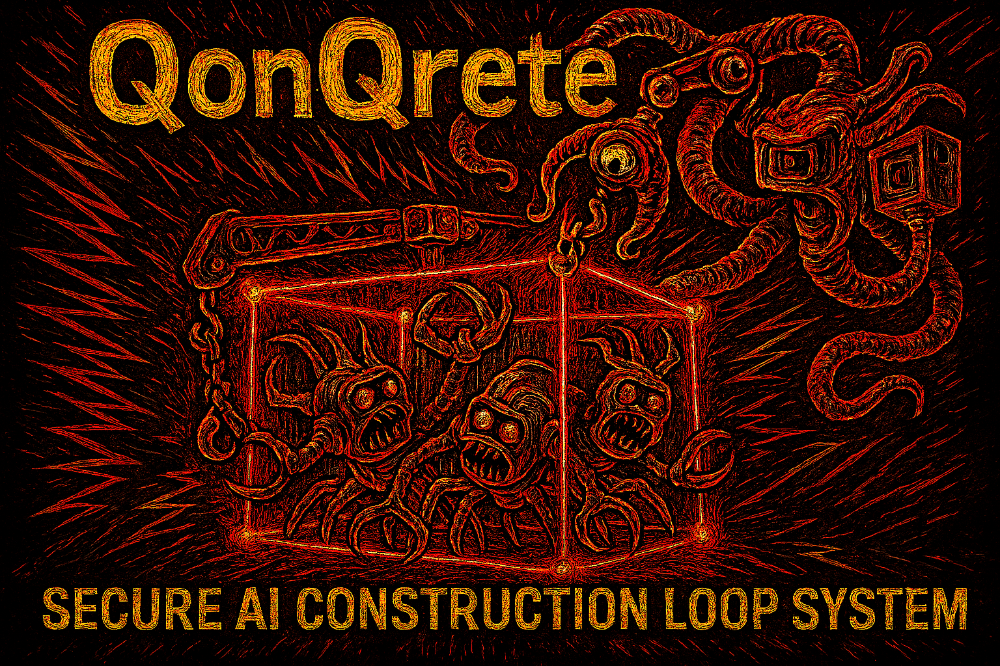

# QonQrete - Secure AI Construction Loop System




QonQrete is a Secure AI Construction Loop System, using a Multi-Agent Pipeline Orchestrator in a Sandbox environment with YAML Configuration. In short: it spawns 3 AI agents in a sandbox/container and makes them work together on tasks. It can run with a hard requirement for user approval between steps, or in a fully autonomous mode where it keeps running until the user decides to stop it.


QonQrete is a multi-agent orchestration system designed for secure, observable, and human-in-the-loop software construction. It operates on the principle of a secure build environment (`Qage`), managed by a host-level orchestrator (`Qrane`).


This architecture ensures that AI-generated code and processes cannot affect the host system, providing a robust framework for autonomous and semi-autonomous development.


## Version


**Version:** `v0.4.0-alpha` (See `VERSION` file for the canonical version).


## Core Principles


1.  **Isolation by Design**: All agent execution occurs within the `Qage`, a Docker container that acts as a secure sandbox. The `Qrane`, running on the host, manages the workflow.


2.  **Configuration-Driven**: The agent models and cycle limits are defined declaratively in `worqspace/config.yaml`.


3.  **File-Based Communication**: Agents communicate by reading and writing markdown files to a shared `worqspace/` volume, creating a transparent and auditable "chat history".


4.  **Human‑in‑the‑Loop Control**: A non‑negotiable **CheQpoint** pauses the system after each `cyQle`. The user, acting as the `gateQeeper`, must review the results and provide explicit instructions to **[Q]ontinue**, **[T]weaQ**, or **[X]Quit**.


## Architecture Overview


-   `qrane/`: Contains the Python-based **Qrane** orchestrator and its command-line interface.


-   `worqer/`: Contains the individual AI agent scripts (`instruQtor`, `construqtor`, `inspeQtor`).


-   `worqspace/`: The shared data plane. It contains all configuration, the initial `tasQ`, and all generated plans (`briQ`), summaries (`exeQ`), and reviews (`reQap`).


## The Workflow CyQle


A `cyQle` consists of three main phases, orchestrated by the `Qrane`:


1.  **Plan (`instruQtor`)**: A `gpt-4o-mini` agent reads the high-level `tasQ` and creates a series of markdown `briQ` files, which contain a detailed, high-level plan for the executor agent.


2.  **Execute (`construQtor`)**: A `gemini-2.5-flash` agent is invoked for each `briQ`. It reads the high-level plan and uses its own powerful agency and tools to generate all necessary files and code in the `qodeyard/` directory.


3.  **Review (`inspeQtor`)**: A `gpt-4o-mini` agent reviews the code generated by the `construQtor`, assesses its quality, and produces a final `reQap` (review) with an assessment and suggestions for the next cycle.


4.  **CheQpoint (`gateQeeper`)**: The `Qrane` pauses the system and displays the `reQap`, waiting for the user's command to proceed.


## System Requirements


The `Qrane` orchestrator runs directly on the host, while the `Qrew` of AI agents runs inside a sandboxed container.


### 1. Docker


Docker is the default, essential runtime for the secure `Qage` environment.


-   **macOS**: Install [Docker Desktop for Mac](https://docs.docker.com/desktop/install/mac-install/).


-   **Linux**:


    -   **Debian/Ubuntu**: `sudo apt-get update && sudo apt-get install docker-ce docker-ce-cli containerd.io`


    -   **Fedora/CentOS**: `sudo dnf install dnf-plugins-core && sudo dnf config-manager --add-repo https://download.docker.com/linux/fedora/docker-ce.repo && sudo dnf install docker-ce docker-ce-cli containerd.io`


-   **Windows**: Install [Docker Desktop for Windows](https://docs.docker.com/desktop/install/windows-install/).


> **Note for Docker Desktop (macOS & Windows) Users:**


> You MUST grant Docker permission to access the project directory. Go to **Settings > Resources > File Sharing** and add the path to your `qonqrete` project folder. This allows the `worqspace` volume to be mounted correctly.


### 2. Python 3


The `Qrane` requires Python 3.


-   **macOS**: Python 3 is typically pre-installed. You can also install it via [Homebrew](https://brew.sh/): `brew install python`.


-   **Linux**:


    -   **Debian/Ubuntu**: `sudo apt-get update && sudo apt-get install python3 python3-pip`


    -   **Fedora/CentOS**: `sudo dnf install python3 python3-pip`


-   **Windows**: Download and install Python from the [official website](https://www.python.org/downloads/).


The only Python dependency for `Qrane` is `PyYAML`. You can install it via pip:


```bash


pip3 install pyyaml


```


### 3. Microsandbox (Optional)


As a lightweight alternative to Docker, you can use `msb`.


-   **Installation**: Follow the instructions at the [official Microsandbox repository](https://github.com/a-i-s-r/microsandbox).


-   You can set `msb` as the default runtime in `worqspace/pipeline_config.yaml`.


## Getting Started


For a full guide on setting up the environment and running your first `cyQle`, please see **[QUICKSTART.md](./QUICKSTART.md)**.


First, initialize the system. This builds the secure container environment.

```bash

# For Docker (default)

./qonqrete.sh init


# If you use Microsandbox

./qonqrete.sh init --msb

```


To run the system with the Text-based User Interface (TUI) and set an operational mode:

```bash

./qonqrete.sh run --tui --mode security

```


To run in autonomous mode with a specific task granularity:

```bash

./qonqrete.sh run --auto --briq-sensitivity 2

```


You can override the configured runtime using flags:

```bash

# Force run with Microsandbox

./qonqrete.sh run --msb


# Force run with Docker

./qonqrete.sh run --docker

```


To clean up the workspace and remove all previous run data:

```bash

./qonqrete.sh clean

```
