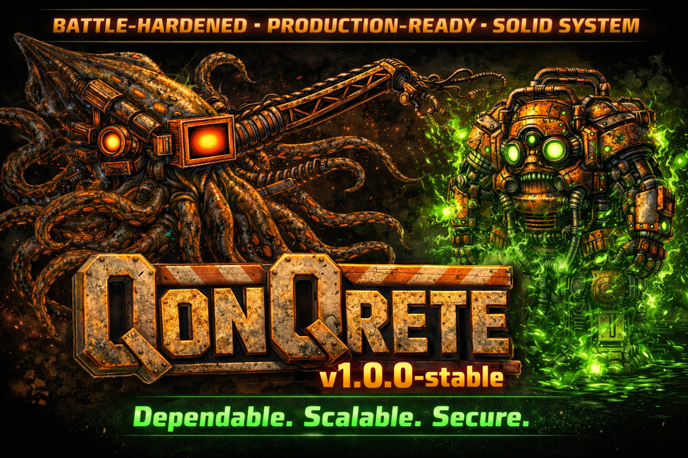

# QonQrete - Secure AI Construction Loop System
[](LICENSE)





QonQrete is a Secure AI Construction Loop System, using a Multi-Agent Pipeline Orchestrator in a Sandbox environment with YAML Configuration. In short: it spawns 3 AI agents in a sandbox/container and makes them work together on tasks. It can run with a hard requirement for user approval between steps, or in a fully autonomous mode where it keeps running until the user decides to stop it.

QonQrete is a multi-agent orchestration system designed for secure, observable, and human-in-the-loop software construction. It operates on the principle of a secure build environment (`Qage`), managed by a host-level orchestrator (`Qrane`).

This architecture ensures that AI-generated code and processes cannot affect the host system, providing a robust framework for autonomous and semi-autonomous development.

## Version

**Version:** `v0.9.0-beta` (See `VERSION` file for the canonical version).

> **Note on TUI Mode and Agent Testing:**
>
> The Text-based User Interface (TUI) mode is currently under active development and may still have bugs. While the agent setup is dynamic, extensive testing is still required.
>
> We welcome community contributions! If you encounter any issues or have suggestions, please report them. Your feedback is invaluable in helping us improve the system.

---

## What's New in v0.9.0-beta

### 🚀 TasqLeveler - Automatic Tasq Enhancement

A new agent that supercharges your tasq.md automatically on Cycle 1:

| Enhancement | Impact |
|-------------|--------|
| 📦 Dependency Graph | Prevents circular imports |
| 🎯 Golden Path Tests | Defines success explicitly |
| 🧪 Mock Infrastructure | Test without real services |
| 📋 Success Criteria | Clear pass/fail |
| ⏱️ Phase Priority | Better token allocation |

**+15-20% improvement in output quality!**

```yaml
# config.yaml - TasqLeveler uses instruqtor's config by default
agents:
  tasqleveler:
    provider: openai
    model: gpt-4.1-mini
```

### 🔧 Universal File Rule (s00permode)

One simple rule for ALL cycles:
- 📁 File EXISTS? → MODIFY/EXTEND it (never recreate)
- 📄 File MISSING? → CREATE it (new modules welcome!)

No more rebuild-from-scratch bugs on multi-cycle builds!

---

## What's New in v0.8.0-beta

### 🌀 Qontrabender - The Cache Bender

A new policy-driven hybrid caching agent with Variable Fidelity:

- **Policy-Based Configuration**: All behavior controlled via `caching_policy.yaml`
- **6 Operational Modes**: `local_fast`, `local_smart`, `cyber_bedrock`, `cyber_aggressive`, `paranoid_mincloud`, `debug_repro`
- **Variable Fidelity**: Intelligently mixes full code (MEAT) + skeletons (BONES)
- **Schema Validation**: Bad YAML can't brick your flow
- **Improved Volatile Detection**: Cycle-based, diff-based, git diff, mtime fallback

```yaml
# Select mode in config.yaml
agents:
  qontrabender:
    policy_file: "./caching_policy.yaml"
    mode: "local_smart"
```

See [QONTRABENDER.md](./doc/QONTRABENDER.md) for full documentation.

---

## The Triple-Core Memory System

QonQrete now features a **Triple-Core Memory System**:

| Agent | Role | Output |
|-------|------|--------|
| **Qompressor** | Skeletonizer | `bloq.d/` - AST-stripped code structures |
| **Qontextor** | Symbol Mapper | `qontext.d/` - Semantic YAML maps |
| **Qontrabender** | Cache Bender | `qache.d/` - Policy-driven cache payloads |

### The Data Lake Architecture

```
┌─────────────────────────────────────────────────────────────────────────┐
│                    THE DATA LAKE (Local)                                │
│                                                                         │
│   qodeyard/ (MEAT)           bloq.d/ (BONES)        qontext.d/ (SOUL)   │
│   Full source code           AST skeletons          Semantic maps       │
│                                                                         │
│             │                        │                      │           │
│             └───────────┬────────────┴──────────────────────┘           │
│                         ▼                                               │
│              ┌───────────────────────┐                                  │
│              │    QONTRABENDER       │ ← Policy-driven compositor       │
│              │   caching_policy.yaml │                                  │
│              └──────────┬────────────┘                                  │
│                         ▼                                               │
│                   qache.d/ (Cache Ledger)                               │
│                   └─ Variable fidelity payloads                         │
└─────────────────────────────────────────────────────────────────────────┘
```

### Performance Metrics

**Scenario:** Medium-sized project (50 files, ~10,000 lines of code)

| Metric | Old Approach | Triple-Core | Improvement |
|--------|--------------|-------------|-------------|
| **Context Sent** | 100,000 Tokens | ~4,000 Tokens | **96% Reduction** |
| **Indexing Cost** | High (AI-based) | **Zero** (Local) | **∞ Cheaper** |
| **Cost per Run** | ~$0.25 (GPT-4o) | ~$0.01 (GPT-4o) | **25x Cheaper** |
| **Cache Reuse** | None | Hash-based dedup | **Near-zero churn** |

---

## Core Principles

1.  **Isolation by Design**: All agent execution occurs within the `Qage`, a Docker container that acts as a secure sandbox.
2.  **Configuration-Driven**: Agent models, modes, and policies defined in YAML.
3.  **File-Based Communication**: Agents communicate via markdown files, creating transparent audit trails.
4.  **Human-in-the-Loop Control**: CheQpoints pause for user review. Can be configured for autonomous mode.
5.  **Local Sovereignty**: Keep intelligence local with policy-driven caching.

---

## Architecture Overview

-   `qrane/`: The **Qrane** orchestrator and CLI
-   `worqer/`: AI agent scripts (`tasqLeveler`, `instruQtor`, `construQtor`, `inspeQtor`, `qompressor`, `qontextor`, `qontrabender`)
-   `worqspace/`: Shared data plane with configuration and generated artifacts

---

## The Workflow CyQle

1.  **Enhance (`tasqLeveler`)**: *Cycle 1 only* - Supercharges tasq with golden paths and mocks
2.  **Plan (`instruQtor`)**: Reads the `tasQ` and creates `briQ` files with detailed plans
3.  **Execute (`construQtor`)**: Processes each `briQ` and generates code in `qodeyard/`
4.  **Review (`inspeQtor`)**: Reviews generated code and produces `reQap` with assessment
5.  **CheQpoint (`gateQeeper`)**: Pauses for user command to proceed

---

## System Requirements

### Docker (Required)

-   **macOS**: [Docker Desktop for Mac](https://docs.docker.com/desktop/install/mac-install/)
-   **Linux**: `sudo apt-get install docker-ce docker-ce-cli containerd.io`
-   **Windows**: [Docker Desktop for Windows](https://docs.docker.com/desktop/install/windows-install/)

> **Docker Desktop Users:** Grant Docker permission to access the project directory via **Settings > Resources > File Sharing**.

### Microsandbox (Optional)

Lightweight alternative to Docker. See [Microsandbox repository](https://github.com/a-i-s-r/microsandbox).

---

## Getting Started

See **[QUICKSTART.md](./doc/QUICKSTART.md)** for the full guide.

### API Keys

Export keys for your AI providers:

```bash
export OPENAI_API_KEY='your-key'
export GOOGLE_API_KEY='your-key'
export ANTHROPIC_API_KEY='your-key'
export DEEPSEEK_API_KEY='your-key'
```

### Initialize

```bash
./qonqrete.sh init
```

### Run

```bash
# With TUI
./qonqrete.sh run --tui --mode security

# Autonomous mode
./qonqrete.sh run --auto --briq-sensitivity 2

# User-gated mode
./qonqrete.sh run --user
```

### Clean

```bash
./qonqrete.sh clean
```

---

## Configuration

### config.yaml

```yaml
agents:
  tasqleveler:
    provider: openai
    model: gpt-4.1-mini  # Runs once on Cycle 1
    
  instruqtor:
    provider: openai
    model: gpt-4.1-mini

  construqtor:
    provider: gemini
    model: gemini-2.5-pro

  inspeqtor:
    provider: openai
    model: gpt-4.1

  qontextor:
    provider: local
    model: qontextor
    local_mode: complex

  qompressor:
    provider: local
    model: qompressor

  qontrabender:
    provider: local
    model: qontrabender
    policy_file: "./caching_policy.yaml"
    mode: local_smart

options:
  use_qompressor: true
  use_qontextor: true
  use_qontrabender: true
  cheqpoint: false
  auto_cycle_limit: 4
```

### Qontrabender Modes

| Mode | Description |
|------|-------------|
| `local_fast` | Ultra-fast, skeleton only |
| `local_smart` | Variable fidelity, balanced (default) |
| `cyber_bedrock` | Remote cache for stable bedrock |
| `cyber_aggressive` | Aggressive remote caching |
| `paranoid_mincloud` | Minimal cloud exposure |
| `debug_repro` | Maximum audit logging |

---

## Documentation

- [QUICKSTART.md](./doc/QUICKSTART.md) - Getting started guide
- [DOCUMENTATION.md](./doc/DOCUMENTATION.md) - Full system documentation
- [QONTRABENDER.md](./doc/QONTRABENDER.md) - Cache bender documentation
- [RELEASE-NOTES.md](./doc/RELEASE-NOTES.md) - Version history
- [TERMINOLOGY.md](./doc/TERMINOLOGY.md) - QonQrete terminology

---

## License

QonQrete is licensed under the GNU Affero General Public License v3.0 (AGPL-3.0).
See the [LICENSE](LICENSE) file for full text.


