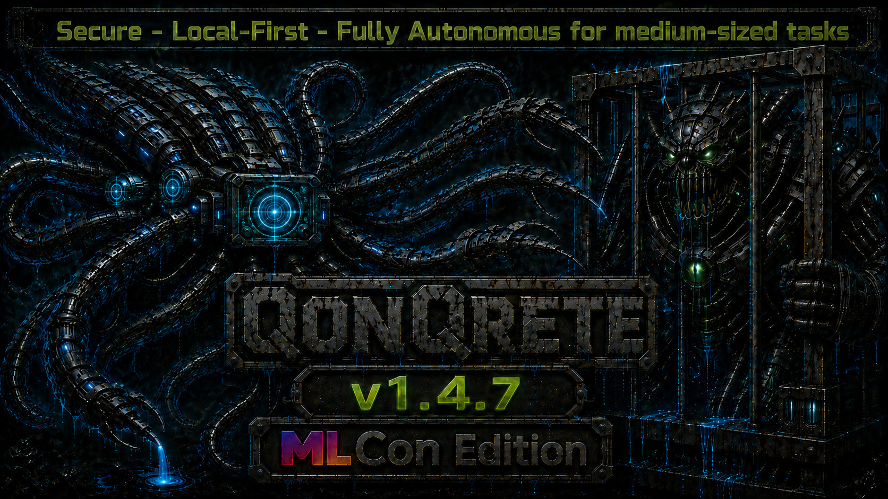

# QonQrete - The First 100% File-Based Local-First Secure Agentic AI System

[](LICENSE)

[](https://github.com/illdynamics/qonqrete/actions/workflows/vscode-extension.yml)
[](https://github.com/illdynamics/qonqrete/actions/workflows/intellij-plugin.yml)



QonQrete is a **local-first, file-based AI software construction system** that runs a structured multi-agent build loop inside a hardened container. It plans work into briqs, generates code in a Qage, reviews the result, and iterates with either **user-gated cheQpoints** or **fully autonomous cycles**.

## Version

**Current repository version:** `v1.2.0`  
Canonical source of truth: `VERSION`

## What this repository contains

This repository currently ships three things:

1. **QonQrete core CLI/runtime**
   - `qonqrete.sh`
   - `qrane/`
   - `worqer/`
   - `worqspace/`
2. **VS Code extension** in `vscode-extension/`
3. **IntelliJ / JetBrains plugin** in `intellij-plugin/`

The IDE integrations let you trigger the existing CLI workflow from inside the IDE. They do **not** replace the core runtime.

> **v1.2.0** — Workspace Deployment & Hassle-Free Bootstrap

QonQrete is a deterministic AI coding agent that builds software inside hardened containers. It takes a high-level task, decomposes it into briqs, generates code, reviews the result, and optionally continues into more cycles — all locally, all file-based, all yours.

## Quick Start (IDE)

### VS Code
1. Install **QonQrete** from the VS Code Marketplace
2. `Ctrl+Shift+P` → **QonQrete: Deploy to Workspace**
3. `Ctrl+Shift+P` → **QonQrete: Create tasq.md** — describe what to build
4. `Ctrl+Shift+P` → **QonQrete: Run Tasq** — auto-init on first run

### IntelliJ / JetBrains
1. Install **QonQrete** from the JetBrains Marketplace
2. `Ctrl+Shift+A` → **QonQrete: Deploy to Workspace**
3. `Ctrl+Shift+A` → **QonQrete: Create tasq.md**
4. `Ctrl+Alt+Q` → **Run Tasq**

### What happens
```
my-project/
  tasq.md              ← you edit this
  .qonqrete/           ← runtime (hidden, gitignored)
    qonqrete.sh
    worqspace/
    qrane/
    worqer/
    ...
```

## Quick Start (CLI)

```bash
# Prerequisites: Docker or Podman + AI API key(s)
export OPENAI_API_KEY='...'

# Build the runtime
chmod +x qonqrete.sh
./qonqrete.sh init

# Edit your task
vim worqspace/tasq.md

# Run
./qonqrete.sh run
./qonqrete.sh run --auto --mode security -b 6 -c 3
```

## How It Works

```
User defines tasq.md
  → TasqLeveler enhances the task (cycle 1)
  → InstruQtor decomposes into briqs + generates QONTRACT
  → CalQulator estimates cost
  → ConstruQtor generates/modifies code in qodeyard/
  → InspeQtor reviews and produces reqap
  → Qontextor indexes context
  → Qompressor creates skeletons
  → Repeat for N cycles
```

All execution happens inside a **hardened container** with:
- Read-only root filesystem
- Dropped capabilities
- Resource limits (memory, CPU, PIDs)
- Non-root runtime

## Architecture

```
qonqrete/
├── qonqrete.sh           # Host entrypoint
├── qrane/                 # Orchestrator
├── worqer/                # Agents (InstruQtor, ConstruQtor, InspeQtor, etc.)
├── worqspace/             # Config + runtime data
├── vscode-extension/      # VS Code integration
├── intellij-plugin/       # JetBrains integration
└── doc/                   # Documentation
```

## Supported AI Providers

| Provider | Env Variable |
|----------|-------------|
| OpenAI | `OPENAI_API_KEY` |
| Google Gemini | `GOOGLE_API_KEY` / `GEMINI_API_KEY` |
| Anthropic | `ANTHROPIC_API_KEY` |
| DeepSeek | `DEEPSEEK_API_KEY` |
| Qwen | `QWEN_API_KEY` |
| OpenRouter | `OPENROUTER_API_KEY` |

## Container Engines

- **Docker** (default, auto-detected)
- **Podman** (auto-detected, macOS machine management included)
- **MicroSandbox** (experimental)

## CLI Reference

```bash
./qonqrete.sh init                           # Build container image
./qonqrete.sh run                            # Fresh run
./qonqrete.sh run --auto                     # Autonomous mode
./qonqrete.sh run -b 6 -c 3                  # Sensitivity 6, 3 cycles
./qonqrete.sh run --mode security            # Security-focused mode
./qonqrete.sh run -a -n myproject            # Auto + save as qonstruction
./qonqrete.sh run -s                         # Seed from sqrapyard
./qonqrete.sh resume                         # Resume from previous qage
./qonqrete.sh clean                          # Interactive qage cleanup
./qonqrete.sh clean -A                       # Delete all qages
```

## IDE Commands (v1.2.0)

Both VS Code and IntelliJ support identical commands:

| Command | Description |
|---------|-------------|
| **Deploy to Workspace** | Install runtime into `.qonqrete/` |
| **Create tasq.md** | Create starter template at project root |
| **Configure Run** | Set sensitivity, cycles, mode, engine |
| **Run Tasq** | Sync tasq → auto-init → execute |
| **Run as QonQrete Tasq** | Run any markdown as temp tasq |
| **Resume Run** | Continue from previous qage |
| **Clean Qages** | Delete old qage directories |
| **Init Workspace** | Manually build container image |
| **Set AI Configuration** | Configure providers, models, and API keys |
| **Show Status** | Display full status info |

## Modes

| Mode | Focus |
|------|-------|
| `program` | General programming (default) |
| `enterprise` | Enterprise applications |
| `security` | Security-focused development |
| `data` | Data processing and analysis |
| `devops` | DevOps and infrastructure |
| `web` | Web development |

## Documentation

- [Quickstart](doc/QUICKSTART.md)
- [Architecture](doc/ARCHITECTURE.md)
- [Documentation](doc/DOCUMENTATION.md)
- [Terminology](doc/TERMINOLOGY.md)
- [Release Notes](doc/RELEASE-NOTES.md)

## Project

- **Website:** [qonqrete.sh](https://qonqrete.sh)
- **Author:** [Ill Dynamics](https://illdynamics.com) / WoNQ
- **License:** [AGPL-3.0](LICENSE)

## Secure API Key Handling

API keys are **never** stored in plain-text settings files, terminal commands, or logs.

### VS Code
Keys are stored in the **OS keychain** via VS Code's `SecretStorage` API. They are injected into the QonQrete process via the terminal's environment map — never in command text.

### IntelliJ / JetBrains
Keys are stored in IntelliJ's **PasswordSafe** (encrypted credential store). They are injected via `PtyCommandLine.environment` — directly into the OS process environment table, never in shell text or temp files.

### Environment variable precedence
1. **Real shell environment** (`OPENAI_API_KEY=...` in your terminal) — always wins
2. **IDE secure storage** — injected only if the env var is not already set
3. **Neither** — the IDE prompts you to enter the key

### Gemini / Google equivalence
`GOOGLE_API_KEY` and `GEMINI_API_KEY` are treated as equivalent. If either is set, the Gemini provider is considered configured.

## AI Configuration Panel

Both IDEs include a **"Set AI Configuration"** command that lets you:
- Set the **provider** and **model** for each agent (TasqLeveler, InstruQtor, ConstruQtor, InspeQtor)
- Set **API keys** for each provider (stored securely)
- See at a glance which keys are set and which are missing

Changes are written directly to `.qonqrete/worqspace/config.yaml`.

After deploying QonQrete to a workspace, the IDE will prompt you to configure AI providers and API keys.

## Cost Confirmation Gate (GateQeeper)

QonQrete can optionally prompt you to confirm a run after the CalQulator estimates cost.

In `worqspace/config.yaml`:

```yaml
options:
  cost_confirmation_gate: false   # set to true to enable
```

When enabled, after CalQulator runs, QonQrete will display the cost estimate and ask:

```
GateQeeper: Cost estimate above. Proceed with this run? [y/N]
```

You must answer `y` or `yes` to continue. Any other answer cancels the run.

This is useful for preventing accidental expensive runs with high sensitivity or many cycles.

## v1.2.0 Highlights

- **One-click workspace deployment** from both IDEs
- **Auto-init** builds container image on first run
- **Root tasq.md** at workspace root (synced to runtime automatically)
- **Versioned container images** (`qonqrete-qage:1.2.0`)
- **Identical behavior** in VS Code and IntelliJ
- No manual cloning, no manual init, no command line required

## What changed between `v1.0.4-stable` and `v1.1.9-stable`

### Core platform
- container runtime auto-detection for Docker / Podman / MSB
- enforced contract workflow via `qontract.d/`
- stricter deterministic run behavior and anti-drift hardening
- resume / clean / qonstruction workflow
- sqrapyard seeding as an explicit opt-in flow
- QONTRACT fail-fast enforcement on later cycles

### VS Code integration
- full VS Code extension with commands, sidebar, status bar, config UI, resume and clean flows
- shell detection / verification and honest run-state handling
- run `worqspace/tasq.md` directly from the IDE
- run any Markdown file temporarily as a QonQrete tasq
- qage browsing and manual packaging as `.vsix`

### IntelliJ / JetBrains integration
- IntelliJ plugin project with tool window, actions, settings, status widget, qage browser, and run controls
- manual packaging flow via Gradle
- local/manual installation path for JetBrains IDEs

## Core principles

- **Isolation by design** — AI execution happens in a Qage container, not directly on the host.
- **File-based communication** — tasqs, briqs, reviews, skeletons, contracts, and logs are visible on disk.
- **Structured iteration** — QonQrete works in cyQles with planning, build, review, and checkpoint phases.
- **Human control when wanted** — autonomous mode exists, but user-gated cheQpoints remain first-class.
- **Local-first supporting stack** — several helper agents run fully locally with zero AI-token cost.

## Architecture in one glance

- **`qonqrete.sh`** — host entrypoint and runtime bootstrap
- **`qrane/`** — orchestrator, TUI, path handling, cost helpers
- **`worqer/`** — agent scripts and security/provider utilities
- **`worqspace/`** — config, task input, sqrapyard, qages, qonstructions
- **`vscode-extension/`** — VS Code integration
- **`intellij-plugin/`** — JetBrains integration

## Main workflow

1. **Enhance** — `tasqleveler` (optional, cycle 1 only)
2. **Plan** — `instruqtor` creates briqs and contract files
3. **Estimate** — `calqulator` estimates token/cost usage
4. **Build** — `construqtor` generates and updates code in `qodeyard/`
5. **Review** — `inspeqtor` validates and reviews results
6. **Index / compress** — `qontextor` and `qompressor` refresh context artifacts
7. **Checkpoint** — continue, tweaQ, or quit

## Directory overview

```text
qonqrete/
├── qonqrete.sh
├── qrane/
├── worqer/
├── worqspace/
│   ├── config.yaml
│   ├── pipeline_config.yaml
│   ├── caching_policy.yaml
│   ├── tasq.md
│   ├── sqrapyard/
│   ├── qonstructions/
│   └── qage_YYYYMMDD_HHMMSS/
├── doc/
├── vscode-extension/
└── intellij-plugin/
```

## Supported AI providers

The current repo supports these providers through `worqer/lib_ai.py` and config:

- OpenAI
- Gemini
- Anthropic
- DeepSeek
- Qwen
- `local` for non-remote helper agents

Required environment variables depend on your selected providers:

```bash
export OPENAI_API_KEY='...'
export GOOGLE_API_KEY='...'        # or GEMINI_API_KEY
export ANTHROPIC_API_KEY='...'
export DEEPSEEK_API_KEY='...'
export QWEN_API_KEY='...'
export OPENROUTER_API_KEY='...'
```

## System requirements

### Container engine
QonQrete auto-detects container runtime support.

Supported runtime paths in the current repo:
- Docker
- Podman
- Microsandbox / MSB (**experimental**)

### Tested platform notes from the repo/docs
- Linux + Docker / Docker Desktop
- macOS + Docker Desktop / Podman
- Windows 11 + WSL2 + Docker Desktop
- Git Bash / MSYS support exists, but WSL2 is still the cleaner Windows experience

## Quickstart

### 1. Initialize the Qage image

```bash
chmod +x qonqrete.sh
./qonqrete.sh init
```

Optional engine forcing:

```bash
./qonqrete.sh init --docker
./qonqrete.sh init --podman
```

### 2. Write your task

Edit:

```text
worqspace/tasq.md
```

### 3. Run

```bash
./qonqrete.sh run
```

Useful variants:

```bash
./qonqrete.sh run --auto
./qonqrete.sh run --user
./qonqrete.sh run -s
./qonqrete.sh run -a -n myproject
./qonqrete.sh run --mode security --briq-sensitivity 6 --cyqles 3
```

### 4. Resume

```bash
./qonqrete.sh resume
./qonqrete.sh resume -q qage_YYYYMMDD_HHMMSS
```

### 5. Clean

```bash
./qonqrete.sh clean
./qonqrete.sh clean -q qage_YYYYMMDD_HHMMSS
./qonqrete.sh clean -A
```

## IDE integrations

### VS Code extension
Location: `vscode-extension/`

Main capabilities in this repo snapshot:
- run canonical `worqspace/tasq.md`
- run any Markdown file as a temporary tasq
- sidebar control panel
- status bar state reporting
- init / run / resume / clean commands
- qage browsing

Manual build/package:

```bash
cd vscode-extension
npm install
npm run compile
npx vsce package
```

### IntelliJ / JetBrains plugin
Location: `intellij-plugin/`

Main capabilities in this repo snapshot:
- tool window with run controls
- settings/config UI
- run, resume, clean, and qage browsing actions
- status widget / shell verification concepts

Manual build/package:

```bash
cd intellij-plugin
./gradlew buildPlugin
```

## Important current-state note

As shipped in this repository, QonQrete is still fundamentally a **repo-local workflow**:
- the core runtime expects `qonqrete.sh` and `worqspace/` in the project
- the bundled IDE integrations are built around that repo-local model
- a fully centralized “single engine outside all projects” bootstrap flow is **not** implemented in this repository snapshot

## CLI reference

```text
Usage: ./qonqrete.sh [COMMAND] [OPTIONS]

Commands:
  init
  run
  resume
  clean

Run options:
  -a, --auto
  -u, --user
  -t, --tui
  -m, --mode <name>
  -b, --briq-sensitivity <0-16>
  -c, --cyqles <1-50>
  -n, --qonstruction-name <name>
  -s, --sqrapyard
  -M, --msb
  -d, --docker
  -p, --podman
  -w, --wonqrete
```

## Documentation map

- [QUICKSTART.md](./doc/QUICKSTART.md) — shortest path to first run
- [DOCUMENTATION.md](./doc/DOCUMENTATION.md) — full technical reference
- [ARCHITECTURE.md](./doc/ARCHITECTURE.md) — architecture and pipeline layout
- [RELEASE-NOTES.md](./doc/RELEASE-NOTES.md) — version history and notable changes
- [TERMINOLOGY.md](./doc/TERMINOLOGY.md) — QonQrete vocabulary

## Current limitations / honesty section

- The bundled IDE integrations are present and usable, but official store publishing is a separate distribution step.
- The repo snapshot does **not** implement a central per-user QonQrete engine installer / bootstrap flow.
- The committed `worqspace/config.yaml` is a working configuration example, not a promise that every default value is ideal for every task.
- `TUI` and `MSB` remain experimental paths.
- Qontrabender only becomes relevant when the active ConstruQtor provider is Gemini.

## License

QonQrete is licensed under the GNU Affero General Public License v3.0 (AGPL-3.0).
See [LICENSE](LICENSE).
