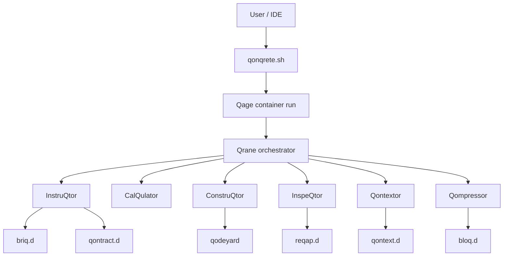

# QonQrete Architecture

**Version:** `v1.2.0`

This document describes the current repository architecture as shipped in the `v1.2.0` snapshot.

## High-level model

QonQrete is split into three layers:

1. **Core runtime** — the CLI entrypoint, orchestrator, agents, config, and generated artifacts
2. **Workspace data plane** — `worqspace/`, qages, qonstructions, and context caches
3. **IDE integrations** — VS Code and IntelliJ / JetBrains wrappers around the CLI workflow

## Top-level layout

```text
qonqrete/
├── qonqrete.sh                # Host entrypoint
├── qrane/                     # Orchestrator layer
├── worqer/                    # Agent and utility layer
├── worqspace/                 # Config + runtime data
├── doc/                       # Documentation set
├── vscode-extension/          # VS Code integration
└── intellij-plugin/           # JetBrains integration
```

## Layer 1 — Host entrypoint

### `qonqrete.sh`
Responsibilities:
- command parsing (`init`, `run`, `resume`, `clean`)
- OS detection
- container engine detection
- build backend detection
- qage creation and workspace seeding
- Qonstruction save / resume / clean flow

The current CLI supports:
- Docker
- Podman
- MSB / Microsandbox (experimental)

It also provides flags for:
- autonomous vs user-gated operation
- operational mode
- briq sensitivity
- cycle limit
- sqrapyard seeding
- explicit runtime forcing
- qonstruction save naming

## Layer 2 — Qrane orchestrator

### `qrane/`
Main files:
- `qrane.py` — orchestrator main loop
- `loader.py` — CLI/UI helper behavior
- `paths.py` — path manager
- `tui.py` — TUI implementation
- `lib_funqtions.py` — pricing helpers

### Runtime responsibilities
Qrane:
- reads `worqspace/config.yaml`
- resolves final mode / sensitivity / cycle count
- validates required API keys for configured providers
- runs the configured pipeline in order
- performs checkpoint handling
- promotes reQap output into the next task flow when continuing

## Layer 3 — Agent layer

### `worqer/`
The repo currently contains these notable agents/utilities:

#### AI / pipeline agents
- `tasqleveler.py`
- `instruqtor.py`
- `construqtor.py`
- `inspeqtor.py`

#### local / deterministic helpers
- `calqulator.py`
- `qontextor.py`
- `qompressor.py`
- `qontrabender.py`
- `qontract_guard.py`
- `loqal_verifier.py`
- `runtime_checks.py`
- `lib_ai.py`
- `lib_security.py`

## Pipeline order

The current committed `worqspace/pipeline_config.yaml` documents the intended order as:

```text
instruqtor → calqulator → construqtor → inspeqtor → qontextor → qompressor
```

Additional notes:
- `tasqleveler` is optional and cycle-1-only
- `qontrabender` is trigger-driven rather than a simple always-on stage
- the docs and code still treat `qodeyard/` as the primary source of truth for current code
- `bloq.d/` and `qontext.d/` are support context layers, not the canonical code output

## Artifact model

Each run gets a dedicated Qage directory:

```text
worqspace/qage_YYYYMMDD_HHMMSS/
```

Typical contents:

```text
tasq.d/
briq.d/
qontract.d/
qodeyard/
exeq.d/
reqap.d/
qontext.d/
bloq.d/
struqture/
```

### Meaning of the main directories
- `tasq.d/` — cycle-specific task material
- `briq.d/` — generated work units
- `qontract.d/` — human + machine-readable contract
- `qodeyard/` — generated / modified code, current truth source
- `exeq.d/` — execution summaries
- `reqap.d/` — review / recap output
- `qontext.d/` — semantic / structural context output
- `bloq.d/` — compressed structural skeletons
- `struqture/` — logs

## QONTRACT enforcement model

The repository uses a contract-first model for later cycles.

### Generation
On cycle 1, InstruQtor generates:
- `qontract.d/qontract.md`
- `qontract.d/qontract.json`

### Enforcement
Later stages use:
- `runtime_checks.py` to fail fast when a contract is required but missing
- `qontract_guard.py` for deterministic AST-based verification

Current documented invariant types include:
- forbidden imports
- schema field expectations
- forbidden field names
- ID type rules
- monotonic ID strategy patterns
- required endpoint checks

## Context / memory layers

QonQrete uses multiple context layers to keep prompts smaller and more structured:

| Layer | Directory | Role |
|------|-----------|------|
| Task | `tasq.d/` | current objective |
| Contract | `qontract.d/` | project rules / constitution |
| Code | `qodeyard/` | current truth source |
| Execution | `exeq.d/` | build summaries |
| Review | `reqap.d/` | review output |
| Skeletons | `bloq.d/` | compressed code structure |
| Semantic map | `qontext.d/` | symbol / dependency hints |
| Cache | `qache.d/` | Qontrabender payloads when used |

## Security model

Important security properties in the repo:
- Qage container isolation
- read-only root filesystem with writable workspace paths
- reduced capability model for container execution
- non-root runtime after entrypoint privilege drop
- path validation and jail enforcement in `lib_security.py`
- API timeout / retry safety in `lib_ai.py`

## IDE integration architecture

## VS Code
`vscode-extension/` wraps the existing CLI rather than replacing it.

It contributes:
- command palette commands
- context menu commands
- sidebar webview
- status bar state
- settings-backed run config
- terminal-driven execution

The extension currently assumes a repo-local QonQrete project and looks for project markers such as:
- `qonqrete.sh`
- `worqspace/config.yaml`
- `tasq.md`

## IntelliJ / JetBrains
`intellij-plugin/` provides a parallel integration path.

It includes:
- Gradle-based plugin project
- plugin README / changelog
- tool-window-oriented UX
- settings and packaging path for manual install / future store publishing

## Current repo-local model

This repository snapshot does **not** yet implement a fully centralized shared engine architecture. The active model is still:

```text
project contains qonqrete.sh + worqspace
IDE integration detects that project
IDE calls the repo-local CLI
```

That should be documented honestly until a central-engine bootstrap workflow actually exists in the codebase.

## Data flow summary



## Related docs

- [README.md](../README.md)
- [DOCUMENTATION.md](./DOCUMENTATION.md)
- [QUICKSTART.md](./QUICKSTART.md)
- [TERMINOLOGY.md](./TERMINOLOGY.md)
- [RELEASE-NOTES.md](./RELEASE-NOTES.md)

## Workspace Deployment Model (v1.2.0)

Starting with v1.2.0, the IDE integrations implement a **workspace-local hidden runtime** deployment model:

```text
my-project/
  tasq.md                    ← user-facing task file
  .qonqrete/                 ← hidden runtime (gitignored)
    qonqrete.sh
    VERSION
    Dockerfile
    qrane/
    worqer/
    worqspace/
      config.yaml
      pipeline_config.yaml
      tasq.md                ← synced from root before each run
      qage_YYYYMMDD_HHMMSS/
```

### Key design decisions

1. **Script-relative runtime preserved**: `qonqrete.sh` still derives `SCRIPT_DIR` and sets `WORKSPACE_DIR` relative to itself. Deploying the full repo structure into `.qonqrete/` means everything works without any runtime architecture changes.

2. **User-facing tasq at workspace root**: The IDE syncs `<workspace>/tasq.md` → `.qonqrete/worqspace/tasq.md` before each run. Users never need to edit hidden files.

3. **Auto-init on first run**: If the container image doesn't exist, the IDE runs `./qonqrete.sh init` automatically.

4. **Versioned images**: Container images are now tagged `qonqrete-qage:<version>` (e.g., `qonqrete-qage:1.2.0`), with `:latest` and legacy untagged aliases for backward compat.

5. **Identical behavior in both IDEs**: VS Code and IntelliJ implement the same commands, same deployment model, same sync behavior.

### Deployment source

Primary: versioned GitHub release zip (`qonqrete-v1.2.0.zip`)
Fallback: shallow git clone if zip download fails
