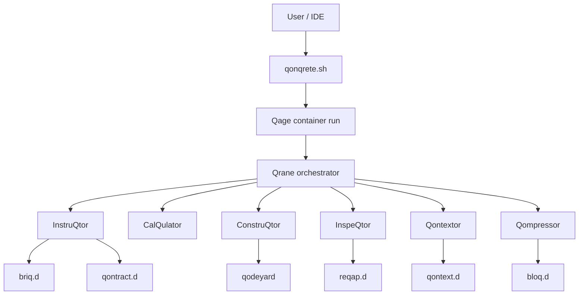

# QonQrete Architecture

**Version:** `v1.4.5`
**Release context:** `v1.4.5`

This document describes the current repository architecture as shipped in the `v1.4.5` snapshot.

## High-level model

QonQrete is split into three layers:

1. **Core runtime** — the CLI entrypoint, orchestrator, agents, config, and generated artifacts
2. **Workspace data plane** — `worqspace/`, qages, qonstructions, and context caches
3. **IDE integrations** — VS Code and IntelliJ / JetBrains wrappers around the CLI workflow

## Top-level layout

```text
qonqrete/
├── qonqrete.sh                # Host entrypoint
├── qrane/                     # Orchestrator layer
├── worqer/                    # Agent and utility layer
├── worqspace/                 # Config + runtime data
├── doc/                       # Documentation set
├── vscode-extension/          # VS Code integration
└── intellij-plugin/           # JetBrains integration
```

## Layer 1 — Host entrypoint

### `qonqrete.sh`
Responsibilities:
- command parsing (`init`, `run`, `resume`, `status`, `audit`, `clean`, `clean-outputs`)
- OS detection
- container engine detection
- build backend detection
- qage creation and manifest-linked workspace seeding
- Qonstruction save / resume / clean flow

The current CLI supports:
- Podman (default auto-detected path)
- Docker (explicit via `--docker` or `CONTAINER_ENGINE=docker`)
- Repo-native host mode (`CONTAINER_ENGINE=none`, and auto fallback when Podman is unavailable)

It also provides flags for:
- autonomous vs user-gated operation
- operational mode
- briq sensitivity
- total-iteration cap (`--cyqles`; build-pass caps remain config-driven)
- optional explicit repo seeding (`--seed-repo`, with legacy `-s/--sqrapyard` alias)
- optional repo-root sync suppression (`-N/--no-sync`)
- explicit runtime forcing
- qonstruction save naming

## Layer 2 — Qrane orchestrator

### `qrane/`
Main files:
- `qrane.py` — orchestrator main loop
- `sqrewdriver_controller.py` — artifact-driven inspection-to-repair stop gate and repair brief builder
- `loader.py` — CLI/UI helper behavior
- `paths.py` — path manager
- `lib_funqtions.py` — pricing helpers

### Runtime responsibilities
Qrane:
- reads `worqspace/config.yaml`
- resolves final mode / sensitivity / execution caps (total iterations, build passes, repair attempts)
- validates required API keys for configured providers
- runs the configured pipeline in canonical stage order
- maintains the run manifest and audit trail
- performs bounded repair and continuation routing
- delegates post-inspection stop-or-repair decisions to the native Sqrewdriver controller when enabled
- distinguishes queued-next-pass resume from interrupted-active-pass resume to preserve truthful pass lineage
- derives validation execution mode from explicit validation/smoketest evidence so markdown presence alone does not overclaim executed coverage

## Layer 3 — Agent layer

### `worqer/`
The repo currently contains these notable agents/utilities:

#### AI / pipeline agents
- `qrystallizer.py` — canonical intake agent; synthesizes high-quality goals and clarified intent context from user answers when the raw task is vague, falling back truthfully to raw context when answers are unresolved.
- `qonstrictor.py`
- `instruqtor.py` — planning agent; consumes clarified intent and synthesized goals as first-class inputs to ensure accurate briq decomposition.
- `construqtor.py` — generates/modifies code in `qodeyard/` via `heredoc` (Markdown fences), `direct` (tool-based), or deterministic `hybrid` coding mode. Supports iterative repair-forward validation in a `validation-root` sandbox.
- `inspeqtor.py`

#### local / deterministic helpers
- `calqulator.py`
- `qontextor.py`
- `qompressor.py`
- `qontrabender.py`
- `qonfirmer.py`
- `qualifier.py`
- `runtime_capabilities.py`
- `lib_ai.py`
- `lib_security.py`

## Pipeline order

The current committed `worqspace/pipeline_config.yaml` bridges the canonical order as:

```text
qrystallizer → qonstrictor → instruqtor → calqulator → construqtor → qontextor/qompressor/qontrabender (support services) → inspeqtor
```

Additional notes:
- `qrystallizer` is the canonical intake implementation
- intake clarification can pause runs in explicit `BLOCKED` / `RUN_WAITING_FOR_INPUT` state when readiness is `NOT_READY`
- clarification-blocked resume re-enters cycle-1 intake semantics so `cycle_1_only` intake stages are not skipped
- `qontrabender` is trigger-driven rather than a simple always-on stage
- `qodeyard/` remains the mutable build surface inside a run, while the manifest is the authoritative linkage layer
- `bloq.d/`, `qontext.d/`, and `qache.d/` are support artifact domains, not canonical lifecycle stages

## Artifact model

Each run gets a dedicated Qage directory:

```text
worqspace/qage_YYYYMMDD_HHMMSS/
```

Typical contents:

```text
tasq.d/
task/
qontract.d/
briq.d/
qontract.d/
planning/
estimation/
qodeyard/
exeq.d/
build/
validation/
realization/
verdict/
continuation/
reqap.d/
qontext.d/
bloq.d/
struqture/
audit/
run-manifest.v1.json
```

### Meaning of the main directories
- `tasq.d/` — compatibility pass task material (`cyqle{N}` folders map to global iteration index)
- `task/` — canonical task spec, clarification log, and intake summary
- `qontract.d/` — Qonstrictor and QONTRACT artifacts
- `briq.d/` — generated work units
- `qontract.d/` — human + machine-readable contract
- `planning/` — execution blueprint, validation plan, build groups, completion criteria
- `estimation/` — estimation artifacts
- `qodeyard/` — generated / modified code build surface
- `exeq.d/` — execution summaries
- `build/` — build-group reports and per-attempt staged/recovery evidence
- `validation/` — validation bundles
- `realization/` — observed-outcome bundles
- `verdict/` — inspection verdicts, repair plans, and Sqrewdriver repair briefs
- `continuation/` — continuation metadata
- `reqap.d/` — review and iteration recap output
- `qontext.d/` — deterministic structural context output
- `bloq.d/` — compressed structural skeletons (Python, shell, JS/TS, HTML/CSS first-class; optional Tree-sitter fallback for other parseable code)
- `struqture/` — per-agent logs
- `audit/` — manifest-linked audit timeline and event stream

## QONTRACT enforcement model

The repository uses a contract-first model for later build passes and repair passes.

## Native Sqrewdriver Controller

QonQrete ports the useful control idea from the sibling `sqrewdriver/` project into `qrane/sqrewdriver_controller.py`. The desktop app and its Bun/Electrobun runtime are not part of the QonQrete execution path.

The controller consumes InspeQtor artifacts:
- `verdict/inspection-verdict.v1.json`
- `verdict/repair-plan.v1.json`
- `validation/validation-bundle.v1.json`
- `realization/realization-bundle.v1.json`
- `planning/completion-criteria.v1.json`

Clean completion requires InspeQtor hard gates to pass, repair flags to be false, required files to exist under `qodeyard/`, and no current hard validation or stale artifact failures. If that gate fails and repair caps allow another pass, the controller writes `verdict/sqrewdriver-repair-brief.v1.md` and `.json`, augments `repair-plan.v1.json`, and Qrane launches the existing same-run repair pass. ConstruQtor receives the brief via `QONQ_SQREWDRIVER_REPAIR_BRIEF_PATH`, while the repair plan remains authoritative for edit scope and locked files.

### Generation
On the first build pass, InstruQtor generates:
- `qontract.d/qontract.md`
- `qontract.d/qontract.json`

### Enforcement
Later stages use:
- fail-fast checks in `qrane/lib_qrane.py` when contract artifacts are required but missing
- `qonfirmer.py` for deterministic AST-based verification

Current documented invariant types include:
- forbidden imports
- schema field expectations
- forbidden field names
- ID type rules
- monotonic ID strategy patterns
- required endpoint checks

## Context / memory layers

QonQrete uses multiple context layers to keep prompts smaller and more structured:

| Layer | Directory | Role |
|------|-----------|------|
| Task | `tasq.d/` | current objective |
| Contract | `qontract.d/` | project rules / constitution |
| Code | `qodeyard/` | current truth source |
| Execution | `exeq.d/` | build summaries |
| Review | `reqap.d/` | review output |
| Skeletons | `bloq.d/` | compressed code structure |
| Structural context map | `qontext.d/` | symbol / relationship hints |
| Cache | `qache.d/` | Qontrabender payloads when used |

## Security model

Important security properties in the repo:
- Qage container isolation
- read-only root filesystem with writable workspace paths
- reduced capability model for container execution
- non-root runtime with no runtime privilege transition
- path validation and jail enforcement in `lib_security.py`
- API timeout / retry safety in `lib_ai.py`

## IDE integration architecture

## VS Code
`vscode-extension/` wraps the existing CLI rather than replacing it.

It contributes:
- command palette commands
- context menu commands
- sidebar webview
- status bar state
- settings-backed run config
- terminal-driven execution

The extension currently assumes a repo-local QonQrete project and looks for project markers such as:
- `qonqrete.sh`
- `worqspace/config.yaml`
- `tasq.md`

## IntelliJ / JetBrains
`intellij-plugin/` provides a parallel integration path.

It includes:
- Gradle-based plugin project
- plugin README / changelog
- tool-window-oriented UX
- settings and packaging path for manual install / future store publishing

## Current repo-local model

This repository snapshot implements a centralized bootstrap model (`qonqrete-bootstrap.sh` for git-clone users, `qonqrete-install.sh` for curl-bash) as well as per-project `.qonqrete/` deployments. The active model is:

```text
project contains qonqrete.sh + worqspace
IDE integration detects that project
IDE calls the repo-local CLI
```

That should be documented honestly until a central-engine bootstrap workflow actually exists in the codebase.

## Data flow summary



## Qontextor extractor model

Qontextor local mode is now a shared structural graph pipeline with registry-dispatched extractors. Today the first-class deterministic paths in the shipped/provisioned environment are:
- Python AST structural graphing
- shell structure and command/env mapping via `shfmt -tojson` in the shipped environment
- JS/TS module, DOM, and storage mapping via a repo-shipped TypeScript helper
- HTML/CSS linkage graphing via repo-shipped `parse5`/`postcss` helpers

This path is structural and offline-safe by default. Reduced local environments can fall back, and the active capability set is surfaced via the capability report and run manifests.

## Related docs

- [README.md](../README.md)
- [DOCUMENTATION.md](./DOCUMENTATION.md)
- [QUICKSTART.md](./QUICKSTART.md)
- [TERMINOLOGY.md](./TERMINOLOGY.md)
- [RELEASE-NOTES.md](./RELEASE-NOTES.md)

## Workspace Deployment Model (v1.2.0+)

Starting with v1.2.0, the IDE integrations implement a **workspace-local hidden runtime** deployment model:

```text
my-project/
  tasq.md                    ← user-facing task file
  .qonqrete/                 ← hidden runtime (gitignored)
    qonqrete.sh
    VERSION
    Dockerfile
    qrane/
    worqer/
    worqspace/
      config.yaml
      pipeline_config.yaml
      tasq.md                ← synced from root before each run
      qage_YYYYMMDD_HHMMSS/
```

### Key design decisions

1. **Script-relative runtime preserved**: `qonqrete.sh` still derives `SCRIPT_DIR` and sets `WORKSPACE_DIR` relative to itself. Deploying the full repo structure into `.qonqrete/` means everything works without any runtime architecture changes.

2. **User-facing tasq at workspace root**: The IDE syncs `<workspace>/tasq.md` → `.qonqrete/worqspace/tasq.md` before each run. Users never need to edit hidden files.

3. **Auto-init on first run**: If the container image doesn't exist, the IDE runs `./qonqrete.sh init` automatically.

4. **Versioned images**: Container images are tagged `qonqrete-qage:<version>` (macOS/Windows) or `qonqrete-qage:<version>-u<host_uid>` (Linux/WSL), plus `:latest`.

5. **Identical behavior in both IDEs**: VS Code and IntelliJ implement the same commands, same deployment model, same sync behavior.

### Deployment source

Primary: versioned GitHub release zip (`qonqrete-v1.4.5.zip`)
Fallback: shallow git clone if zip download fails
