# QonQrete Architecture

**Version:** `v1.0.4-stable` (See `VERSION` file for the canonical version).

This document provides a comprehensive architectural overview of the QonQrete Secure AI Construction Loop System, including system diagrams, pipeline flows, directory structure, and cost analysis.

## Table of Contents
- [High-Level System Overview](#high-level-system-overview)
- [Pipeline Flow](#pipeline-flow)
- [ConstruQtor Build Loop](#construqtor-build-loop)
- [InspeQtor Review Flow](#inspeqtor-review-flow)
- [Contract Enforcement Flow](#contract-enforcement-flow)
- [Container Runtime Detection](#container-runtime-detection)
- [Directory Structure](#directory-structure)
- [Cost Flow](#cost-flow)

---

## High-Level System Overview

```mermaid
flowchart TB
    subgraph HOST["🖥️ Host System"]
        User([👤 User])
        Shell[./qonqrete.sh]
        Version[VERSION<br/>v1.0.4]
    end

    subgraph DETECT["🔍 Auto-Detection Layer"]
        OSDetect[OS Detection<br/>Linux / Darwin / WSL / MSYS]
        EngineDetect[Engine Detection<br/>Docker / Podman / MSB]
        BuildDetect[Build Backend<br/>buildx / plain]
    end

    subgraph CONTAINER["🐳 Container Runtime"]
        subgraph QRANE["🏗️ Qrane Orchestrator"]
            Loader[loader.py<br/>Config Parser]
            TUI[tui.py<br/>Display Filter]
            PathMgr[paths.py<br/>Path Manager]
            MainLoop[qrane.py<br/>Main Loop]
        end

        subgraph AGENTS["🤖 Agent Pipeline"]
            direction TB
            
            subgraph LOCAL["⚡ Local Agents (Zero Cost)"]
                Qompressor[🦴 Qompressor<br/>Skeletonizer]
                Qontextor[🔍 Qontextor<br/>AST + Jedi + Embeddings]
                CalQulator[🧮 CalQulator<br/>Cost Estimator]
                LoQal[✅ LoQal Verifier<br/>Syntax + Imports]
                QontractGuard[🔒 QontractGuard<br/>AST Contract Checker]
            end

            subgraph AI["🧠 AI Agents"]
                TasqLeveler[📊 TasqLeveler<br/>Tasq Enhancer]
                InstruQtor[📋 InstruQtor<br/>Briq Planner + Contract Gen]
                ConstruQtor[🔨 ConstruQtor<br/>Code Generator]
                InspeQtor[🔎 InspeQtor<br/>Multi-Stage Reviewer]
            end

            subgraph CACHE["💾 Cache Layer"]
                Qontrabender[🌀 Qontrabender<br/>Hybrid Cache<br/>Gemini-only]
            end
        end

        subgraph LIBAI["🔌 AI Provider Abstraction"]
            LibAI[lib_ai.py]
            OpenAI[(OpenAI<br/>gpt-4.1-*)]
            Gemini[(Gemini<br/>2.5-flash/pro)]
            Anthropic[(Anthropic<br/>claude-*)]
            DeepSeek[(DeepSeek<br/>chat/coder)]
            Qwen[(Qwen<br/>qwen3-coder)]
        end
    end

    subgraph WORQSPACE["📁 Worqspace Volume"]
        Config[config.yaml]
        PipeConfig[pipeline_config.yaml]
        TasQ[tasq.md]
        
        subgraph QAGE["📦 qage_timestamp/"]
            BriqD[briq.d/]
            BloqD[bloq.d/]
            QontextD[qontext.d/]
            QontractD[qontract.d/<br/>qontract.md + .json]
            Qodeyard[qodeyard/]
            ExeqD[exeq.d/]
            ReqapD[reqap.d/]
            StruqtureD[struqture/<br/>Logs]
        end
    end

    User --> Shell
    Shell --> DETECT
    DETECT --> CONTAINER
    
    MainLoop --> Loader
    MainLoop --> TUI
    MainLoop --> PathMgr
    
    MainLoop --> TasqLeveler
    MainLoop --> InstruQtor
    MainLoop --> CalQulator
    MainLoop --> ConstruQtor
    MainLoop --> InspeQtor
    MainLoop --> Qontextor
    MainLoop --> Qompressor
    MainLoop --> Qontrabender
    
    ConstruQtor --> LoQal
    ConstruQtor --> QontractGuard
    InspeQtor --> QontractGuard
    InspeQtor --> LoQal
    
    InstruQtor --> LibAI
    ConstruQtor --> LibAI
    InspeQtor --> LibAI
    TasqLeveler --> LibAI
    
    LibAI --> OpenAI
    LibAI --> Gemini
    LibAI --> Anthropic
    LibAI --> DeepSeek
    LibAI --> Qwen
    
    InstruQtor --> BriqD
    InstruQtor --> QontractD
    ConstruQtor --> Qodeyard
    ConstruQtor --> ExeqD
    InspeQtor --> ReqapD
    Qompressor --> BloqD
    Qontextor --> QontextD
    
    classDef host fill:#2d2d2d,stroke:#888,color:#fff
    classDef detect fill:#2a2a1a,stroke:#aa8,color:#fff
    classDef local fill:#1a1a3a,stroke:#44a,color:#fff
    classDef ai fill:#3a1a1a,stroke:#a44,color:#fff
    classDef cache fill:#3a3a1a,stroke:#aa4,color:#fff
    classDef volume fill:#2a1a2a,stroke:#a4a,color:#fff
    classDef provider fill:#1a2a2a,stroke:#4aa,color:#fff
    
    class User,Shell,Version host
    class OSDetect,EngineDetect,BuildDetect detect
    class Qompressor,Qontextor,CalQulator,LoQal,QontractGuard local
    class InstruQtor,ConstruQtor,InspeQtor,TasqLeveler ai
    class Qontrabender cache
    class Config,PipeConfig,TasQ,BriqD,BloqD,QontextD,QontractD,Qodeyard,ExeqD,ReqapD,StruqtureD volume
    class OpenAI,Gemini,Anthropic,DeepSeek,Qwen provider
```

---

## Pipeline Flow

```mermaid
flowchart LR
    subgraph CYCLE["🔄 CyQle N"]
        direction TB
        
        subgraph PREP["1️⃣ Warmup Phase (Cycle 1 only if sqrapyard)"]
            Qompressor[🦴 Qompressor<br/>Generate Skeletons]
            Qontextor[🔍 Qontextor<br/>Build Symbol Map]
            Qontrabender[🌀 Qontrabender<br/>Warm Qache]
            Qompressor --> Qontextor
            Qontextor --> Qontrabender
        end
        
        subgraph PLAN["2️⃣ Planning Phase"]
            TasqLeveler[📊 TasqLeveler<br/>Enhance TasQ]
            InstruQtor[📋 InstruQtor<br/>TasQ → BriQs + QONTRACT]
            CalQulator[🧮 CalQulator<br/>Estimate Costs]
            TasqLeveler --> InstruQtor
            InstruQtor --> CalQulator
        end
        
        subgraph BUILD["3️⃣ Build Phase (Interleaved)"]
            direction TB
            ConstruQtor[🔨 ConstruQtor<br/>Generate Code]
            ContractCheck[🔒 QontractGuard<br/>Per-Briq Check]
            LoQalBuild[✅ LoQal<br/>Verify Syntax]
            Retry{Retry?}
            
            CalQulator --> ConstruQtor
            ConstruQtor --> ContractCheck
            ContractCheck -->|PASS| LoQalBuild
            ContractCheck -->|FAIL| Retry
            LoQalBuild -->|FAIL| Retry
            Retry -->|Yes| ConstruQtor
            Retry -->|No| NextBriq
            LoQalBuild -->|PASS| NextBriq[Next BriQ]
            NextBriq -->|More BriQs| ConstruQtor
        end
        
        subgraph REVIEW["4️⃣ Review Phase"]
            QontractFull[🔒 QontractGuard<br/>Full Codebase Check]
            LoQalFull[✅ LoQal Verifier<br/>Full Verification]
            InspeQtor[🔎 InspeQtor<br/>AI Review]
            MetaReview[📊 Meta-Review<br/>Consolidate]
            NextBriq -->|All Done| QontractFull
            QontractFull --> LoQalFull
            LoQalFull --> InspeQtor
            InspeQtor --> MetaReview
        end
        
        subgraph POST["5️⃣ Post Phase"]
            QontextorUpdate[🔍 Qontextor<br/>Update Index]
            QompressorUpdate[🦴 Qompressor<br/>Update Skeletons]
            MetaReview --> QontextorUpdate
            QontextorUpdate --> QompressorUpdate
        end
        
        subgraph CHECKPOINT["6️⃣ CheQpoint"]
            CheQpoint{User Decision}
            QompressorUpdate --> CheQpoint
            CheQpoint -->|Continue| NextCycle([CyQle N+1])
            CheQpoint -->|TweaQ| TweaQ[Edit ReQap]
            CheQpoint -->|Quit| Done([Exit])
            TweaQ --> NextCycle
        end
    end
    
    style PREP fill:#1a1a3a,stroke:#44a
    style PLAN fill:#2a1a2a,stroke:#a4a
    style BUILD fill:#3a1a1a,stroke:#a44
    style REVIEW fill:#1a3a1a,stroke:#4a4
    style POST fill:#3a3a1a,stroke:#aa4
    style CHECKPOINT fill:#2a2a2a,stroke:#888
```

---

## ConstruQtor Build Loop

```mermaid
flowchart TB
    subgraph CONSTRUQTOR["🔨 ConstruQtor v1.0.4 - Per-BriQ Processing"]
        Start([Start]) --> LoadBriqs[Load BriQ Files]
        LoadBriqs --> CheckContract{qontract.d<br/>exists?}
        CheckContract -->|No + Cycle>1| FailFast[❌ FAIL-FAST<br/>Contract Missing]
        CheckContract -->|Yes or Cycle 1| ForEach{For Each BriQ}
        
        ForEach --> Attempt[Attempt 1/3]
        
        subgraph ATTEMPT["Build Attempt"]
            Attempt --> Context[Gather Context<br/>qontract.md + bloq.d + qontext.d]
            Context --> Prompt[Build AI Prompt<br/>+ Cycle1 TasQ + Qodeyard Tree]
            Prompt --> AICall[🧠 AI Generate Code]
            AICall --> Parse[Parse Response<br/>Extract Files]
            Parse --> Write[Write to qodeyard/]
        end
        
        subgraph VERIFY["Per-Briq Verification"]
            Write --> ContractGuard[🔒 QontractGuard<br/>Contract-Relevant Briqs]
            ContractGuard -->|FAIL| ContractRetry{Contract Retry?}
            ContractGuard -->|PASS/SKIP| Syntax[Python compile]
            Syntax -->|Error| SyntaxFail[❌ Syntax Error]
            Syntax -->|OK| Imports[Check Imports]
            Imports --> Pass[✅ Passed]
        end
        
        ContractRetry -->|Yes| Attempt
        ContractRetry -->|No| MarkFail
        SyntaxFail --> RetryCheck{Attempts < 3?}
        RetryCheck -->|Yes| Attempt
        RetryCheck -->|No| MarkFail[Mark FAILURE]
        
        Pass --> WriteExeq[Write exeQ Summary]
        MarkFail --> WriteExeq
        
        WriteExeq --> ForEach
        ForEach -->|Done| Complete([All BriQs Complete])
    end
    
    style ATTEMPT fill:#3a1a1a,stroke:#a44
    style VERIFY fill:#1a3a1a,stroke:#4a4
```

---

## InspeQtor Review Flow

```mermaid
flowchart TB
    subgraph INSPEQTOR["🔎 InspeQtor v1.0.4 - Multi-Stage Review"]
        Start([Start]) --> CheckContract{qontract.d<br/>exists?}
        CheckContract -->|No + Cycle>1| FailFast[❌ FAIL-FAST]
        CheckContract -->|Yes| Stage0
        
        subgraph STAGE0["Stage 0: QontractGuard (Deterministic)"]
            Stage0[Load qontract.json] --> RunGuard[🔒 AST-Based Check<br/>All qodeyard/* Files]
            RunGuard -->|Violations| GuardFail[Force Cycle FAIL<br/>+ Violation Report]
            RunGuard -->|Clean| GuardPass[✅ Contract Satisfied]
        end
        
        subgraph STAGE1["Stage 1: LoQal Verification (Deterministic)"]
            GuardPass --> LoQal[✅ Syntax + Import Checks]
            GuardFail --> LoQal
        end
        
        subgraph STAGE2["Stage 2: Per-BriQ AI Reviews"]
            LoQal --> GatherBriqs[Gather ExeQs + Code]
            GatherBriqs --> ForBatch{Batch or Individual}
            ForBatch --> AIReview[🧠 AI Tactical Review<br/>Context: qontract.md + qodeyard]
            AIReview --> WriteReqaps[Write Per-BriQ ReQaps]
        end
        
        subgraph STAGE3["Stage 3: Meta-Review (AI)"]
            WriteReqaps --> GatherAll[Gather All ReQaps]
            GatherAll --> MetaAI[🧠 Consolidate Assessment]
            MetaAI --> FinalReqap[Write Final ReQap<br/>Assessment: SUCCESS/PARTIAL/FAILURE]
        end
        
        FinalReqap --> Done([Complete])
    end
    
    style STAGE0 fill:#3a1a1a,stroke:#a44
    style STAGE1 fill:#1a1a3a,stroke:#44a
    style STAGE2 fill:#1a3a1a,stroke:#4a4
    style STAGE3 fill:#3a3a1a,stroke:#aa4
```

---

## Contract Enforcement Flow

```mermaid
flowchart TB
    subgraph CONTRACT["🔒 QONTRACT Lifecycle"]
        direction TB
        
        subgraph GEN["Cycle 1: Generation"]
            TasQ[tasq.md] --> InstruQtor[InstruQtor extracts<br/>rules + invariants]
            InstruQtor --> MD[qontract.d/qontract.md<br/>Human-readable rules]
            InstruQtor --> JSON[qontract.d/qontract.json<br/>Machine-parseable]
        end
        
        subgraph ENFORCE["Cycle 2+: Enforcement"]
            JSON --> Guard[QontractGuard<br/>Python AST Parser]
            
            Guard --> ForbidImports[Forbidden Imports<br/>e.g. uuid]
            Guard --> SchemaFields[Exact Schema Fields<br/>Pydantic models]
            Guard --> ForbidFields[Forbidden Field Names]
            Guard --> IDType[ID Type Rules<br/>int vs str]
            Guard --> IDStrategy[Monotonic ID Strategy<br/>next_id + increment]
            Guard --> Endpoints[Required Endpoints<br/>Route decorators]
        end
        
        subgraph GATE["Gating"]
            ForbidImports --> Result{Violations?}
            SchemaFields --> Result
            ForbidFields --> Result
            IDType --> Result
            IDStrategy --> Result
            Endpoints --> Result
            
            Result -->|None| Pass[✅ PASS]
            Result -->|Found| Fail[❌ FAIL<br/>+ Violation Report]
        end
    end
    
    style GEN fill:#1a3a1a,stroke:#4a4
    style ENFORCE fill:#3a1a1a,stroke:#a44
    style GATE fill:#3a3a1a,stroke:#aa4
```

---

## Container Runtime Detection

```mermaid
flowchart TB
    subgraph DETECTION["🔍 v1.0.4 Auto-Detection"]
        Start([qonqrete.sh]) --> DetectOS[detect_os]
        
        DetectOS --> Linux[Linux]
        DetectOS --> Darwin[macOS / Darwin]
        DetectOS --> WSL[WSL2]
        DetectOS --> MSYS[Git Bash / MSYS]
        
        Linux --> DetectEngine
        Darwin --> DetectEngine
        WSL --> DetectEngine
        MSYS --> DetectEngine
        
        DetectEngine[detect_engine] --> EnvCheck{CONTAINER_ENGINE<br/>env set?}
        EnvCheck -->|Yes| UseEnv[Use env value]
        EnvCheck -->|No| CLICheck{CLI flag?}
        CLICheck -->|--docker| UseDocker[docker]
        CLICheck -->|--podman| UsePodman[podman]
        CLICheck -->|--msb| UseMSB[msb]
        CLICheck -->|None| MSBConfig{MSB in config?}
        MSBConfig -->|Yes| UseMSB
        MSBConfig -->|No| AutoDetect{docker available?}
        AutoDetect -->|Yes| UseDocker
        AutoDetect -->|No| PodmanCheck{podman available?}
        PodmanCheck -->|Yes| UsePodman
        PodmanCheck -->|No| Error[❌ No engine found]
        
        UseDocker --> BuildBackend[detect_build_backend]
        UsePodman --> PodmanMachine[ensure_podman_machine<br/>macOS only]
        PodmanMachine --> BuildBackend
        
        BuildBackend --> Buildx{buildx available?}
        Buildx -->|Yes| UseBuildx[buildx mode]
        Buildx -->|No| UsePlain[plain mode]
        
        Darwin --> PodmanMachine
    end
    
    style DETECTION fill:#1a1a3a,stroke:#44a
```

---

## Directory Structure

```mermaid
flowchart TB
    subgraph DIRS["📁 QonQrete Directory Structure v1.0.4"]
        direction TB
        
        subgraph ROOT["qonqrete/"]
            qonqrete_sh[qonqrete.sh<br/>Entry Point + Auto-Detect]
            VERSION[VERSION<br/>1.0.4]
            Dockerfile[Dockerfile<br/>Security Hardened]
            entrypoint[entrypoint.sh<br/>Root Dropping]
            Sandboxfile[Sandboxfile<br/>MSB Config]
            requirements[requirements.txt<br/>Pinned Deps]
            COPYRIGHT[COPYRIGHT]
            LICENSE[LICENSE - AGPLv3]
        end
        
        subgraph QRANE["qrane/"]
            qrane_py[qrane.py<br/>Orchestrator]
            loader[loader.py<br/>Spinner + Colors]
            paths[paths.py<br/>Path Manager]
            tui_py[tui.py<br/>TUI Display]
            lib_funq[lib_funqtions.py<br/>Token Pricing]
        end
        
        subgraph WORQER["worqer/"]
            lib_ai[lib_ai.py<br/>AI Abstraction + DeepSeek]
            lib_security[lib_security.py<br/>Security Utils]
            runtime_checks[runtime_checks.py<br/>Fail-Fast Guards]
            tasqleveler[tasqleveler.py<br/>Optional Enhancer]
            instruqtor[instruqtor.py<br/>Planner + Contract Gen]
            calqulator[calqulator.py<br/>Cost Estimator]
            construqtor[construqtor.py<br/>Code Generator]
            inspeqtor[inspeqtor.py<br/>Multi-Stage Reviewer]
            qontextor[qontextor.py<br/>Dual-Mode Indexer]
            qompressor[qompressor.py<br/>Skeletonizer]
            qontrabender[qontrabender.py<br/>Cache Bender]
            qontract_guard[qontract_guard.py<br/>Contract Verifier]
            loqal_verifier[loqal_verifier.py<br/>Local Verifier]
        end
        
        subgraph WORQSPACE["worqspace/"]
            config[config.yaml]
            pipeline[pipeline_config.yaml]
            caching[caching_policy.yaml]
            tasq[tasq.md]
            sqrapyard[sqrapyard/<br/>Seed Files]
            qonstructions[qonstructions/<br/>Saved Projects]
            
            subgraph QAGE["qage_YYYYMMDD_HHMMSS/"]
                tasq_d[tasq.d/<br/>Cycle Directives]
                briq_d[briq.d/<br/>Planned Steps]
                qontract_d[qontract.d/<br/>Project Constitution]
                qodeyard_g[qodeyard/<br/>Generated Code]
                exeq_d[exeq.d/<br/>Build Summaries]
                reqap_d[reqap.d/<br/>Reviews]
                bloq_d[bloq.d/<br/>Skeletons]
                qontext_d[qontext.d/<br/>Symbol Maps]
                struqture[struqture/<br/>Logs]
            end
        end
        
        subgraph DOC["doc/"]
            docs[DOCUMENTATION.md<br/>ARCHITECTURE.md<br/>QUICKSTART.md<br/>TERMINOLOGY.md<br/>RELEASE-NOTES.md<br/>QONTRABENDER.md]
        end

        subgraph TESTS["tests/"]
            test1[test_v1_0_4.py<br/>58 tests]
            test2[test_v1_0_4_stable_smoke.py<br/>52 tests]
        end
    end
    
    style ROOT fill:#2d2d2d,stroke:#888
    style QRANE fill:#1a3a1a,stroke:#4a4
    style WORQER fill:#3a1a1a,stroke:#a44
    style WORQSPACE fill:#2a1a2a,stroke:#a4a
    style QAGE fill:#3a3a1a,stroke:#aa4
    style DOC fill:#1a1a3a,stroke:#44a
    style TESTS fill:#1a2a2a,stroke:#4aa
```

---

## Cost Flow

```mermaid
flowchart LR
    subgraph COSTS["💰 Token Cost Flow (v1.0.4)"]
        
        subgraph FREE["🆓 Zero Cost"]
            Qompressor[Qompressor<br/>Local Python AST]
            Qontextor[Qontextor<br/>AST + Jedi + Embeddings]
            CalQulator[CalQulator<br/>Local Math]
            LoQal[LoQal Verifier<br/>compile + imports]
            QontractGuard[QontractGuard<br/>AST Contract Check]
            Qontrabender[Qontrabender<br/>Local Cache]
        end
        
        subgraph CHEAP["💵 Low Cost"]
            TasqLeveler[TasqLeveler<br/>gpt-4.1-mini<br/>$0.10/1M in]
            InstruQtor[InstruQtor<br/>gpt-4.1-mini<br/>$0.10/1M in]
            InspeQtorBatch[InspeQtor<br/>gpt-4.1-mini<br/>$0.40/1M in]
        end
        
        subgraph MAIN["💰 Main Cost"]
            ConstruQtor[ConstruQtor<br/>deepseek-chat<br/>$1.25/1M in]
        end
    end
    
    FREE --> CHEAP
    CHEAP --> MAIN
    
    style FREE fill:#1a3a1a,stroke:#4a4
    style CHEAP fill:#3a3a1a,stroke:#aa4
    style MAIN fill:#3a1a1a,stroke:#a44
```

