# QonQrete Documentation

**Version:** `v0.9.3-beta` (See `VERSION` file for the canonical version).

This document provides a comprehensive overview of the QonQrete Secure AI Construction Loop System.

## Table of Contents
- [Architecture](#architecture)
  - [High-Level System Overview](#high-level-system-overview)
  - [Detailed Pipeline Flow](#detailed-pipeline-flow)
  - [ConstruQtor Build Loop (Interleaved Mode)](#construqtor-build-loop-interleaved-mode)
  - [InspeQtor Batched Review Flow](#inspeqtor-batched-review-flow)
  - [Directory Structure](#directory-structure)
- [Execution Flows](#execution-flows)
- [Agent & Orchestrator Logic](#agent--orchestrator-logic)
- [Configuration](#configuration)
- [Getting Started](#getting-started)
- [Terminology](#terminology)

## Architecture

This section contains Mermaid diagrams illustrating the complete architecture of the QonQrete system v0.8.8.

### High-Level System Overview

```mermaid
flowchart TB
    subgraph HOST["🖥️ Host System"]
        User([👤 User])
        Shell[./qonqrete.sh]
        EnvFile[.env<br/>API Keys]
        Version[VERSION<br/>v0.8.8]
    end

    subgraph CONTAINER["🐳 Container Runtime"]
        subgraph QRANE["🏗️ Qrane Orchestrator"]
            Loader[loader.py<br/>Config Parser]
            TUI[tui.py<br/>Display Filter]
            PathMgr[paths.py<br/>Path Manager]
            MainLoop[qrane.py<br/>Main Loop]
        end

        subgraph AGENTS["🤖 Agent Pipeline"]
            direction TB
            
            subgraph LOCAL["⚡ Local Agents (Zero Cost)"]
                Qompressor[🦴 Qompressor<br/>Skeletonizer]
                Qontextor[🔍 Qontextor<br/>AST + Jedi + PyCG]
                CalQulator[🧮 CalQulator<br/>Cost Estimator]
                LoQal[✅ LoQal Verifier<br/>Syntax + Imports]
            end

            subgraph AI["🧠 AI Agents"]
                InstruQtor[📋 InstruQtor<br/>Briq Planner]
                ConstruQtor[🔨 ConstruQtor<br/>Code Generator]
                InspeQtor[🔎 InspeQtor<br/>Batched Reviewer]
            end

            subgraph CACHE["💾 Cache Layer"]
                Qontrabender[🌀 Qontrabender<br/>Hybrid Cache]
            end
        end

        subgraph LIBAI["🔌 AI Provider Abstraction"]
            LibAI[lib_ai.py]
            OpenAI[(OpenAI<br/>gpt-4.1-*)]
            Gemini[(Gemini<br/>2.5-flash/pro)]
            Anthropic[(Anthropic<br/>claude-*)]
            DeepSeek[(DeepSeek<br/>V3.2)]
            Qwen[(Qwen<br/>qwen3-coder)]
        end
    end

    subgraph WORQSPACE["📁 Worqspace Volume"]
        Config[config.yaml]
        PipeConfig[pipeline_config.yaml]
        TasQ[tasq.md]
        
        subgraph QAGE["📦 qage_timestamp/"]
            BriqD[briq.d/]
            BloqD[bloq.d/]
            QontextD[qontext.d/]
            Qodeyard[qodeyard/]
            ExeqD[exeq.d/]
            ReqapD[reqap.d/]
            StruqtureD[struqture/<br/>Logs]
        end
    end

    User --> Shell
    Shell --> EnvFile
    Shell --> Version
    Shell --> CONTAINER
    
    MainLoop --> Loader
    MainLoop --> TUI
    MainLoop --> PathMgr
    
    Loader --> Config
    Loader --> PipeConfig
    
    MainLoop --> Qompressor
    MainLoop --> Qontextor
    MainLoop --> CalQulator
    MainLoop --> InstruQtor
    MainLoop --> ConstruQtor
    MainLoop --> InspeQtor
    MainLoop --> Qontrabender
    
    ConstruQtor --> LoQal
    
    InstruQtor --> LibAI
    ConstruQtor --> LibAI
    InspeQtor --> LibAI
    
    LibAI --> OpenAI
    LibAI --> Gemini
    LibAI --> Anthropic
    LibAI --> DeepSeek
    LibAI --> Qwen
    
    TasQ --> InstruQtor
    InstruQtor --> BriqD
    
    Qodeyard --> Qompressor
    Qompressor --> BloqD
    
    Qodeyard --> Qontextor
    Qontextor --> QontextD
    
    BriqD --> CalQulator
    BloqD --> CalQulator
    
    BriqD --> ConstruQtor
    BloqD --> ConstruQtor
    ConstruQtor --> Qodeyard
    ConstruQtor --> ExeqD
    
    Qodeyard --> InspeQtor
    ExeqD --> InspeQtor
    InspeQtor --> ReqapD
    
    Qontrabender --> BloqD
    
    classDef host fill:#2d2d2d,stroke:#888,color:#fff
    classDef container fill:#1a3a1a,stroke:#4a4,color:#fff
    classDef local fill:#1a1a3a,stroke:#44a,color:#fff
    classDef ai fill:#3a1a1a,stroke:#a44,color:#fff
    classDef cache fill:#3a3a1a,stroke:#aa4,color:#fff
    classDef volume fill:#2a1a2a,stroke:#a4a,color:#fff
    classDef provider fill:#1a2a2a,stroke:#4aa,color:#fff
    
    class User,Shell,EnvFile,Version host
    class Qompressor,Qontextor,CalQulator,LoQal local
    class InstruQtor,ConstruQtor,InspeQtor ai
    class Qontrabender cache
    class Config,PipeConfig,TasQ,BriqD,BloqD,QontextD,Qodeyard,ExeqD,ReqapD,StruqtureD volume
    class OpenAI,Gemini,Anthropic,DeepSeek,Qwen provider
```

### Detailed Pipeline Flow

```mermaid
flowchart LR
    subgraph CYCLE["🔄 CyQle N"]
        direction TB
        
        Start([Start CyQle]) --> Qompressor
        
        subgraph PREP["1️⃣ Preparation Phase"]
            Qompressor[🦴 Qompressor<br/>Generate Skeletons]
            Qontextor[🔍 Qontextor<br/>Build Symbol Map]
            Qompressor --> Qontextor
        end
        
        subgraph PLAN["2️⃣ Planning Phase"]
            InstruQtor[📋 InstruQtor<br/>Decompose TasQ → BriQs]
            CalQulator[🧮 CalQulator<br/>Estimate Costs]
            Qontextor --> InstruQtor
            InstruQtor --> CalQulator
        end
        
        subgraph BUILD["3️⃣ Build Phase (Interleaved)"]
            direction TB
            ConstruQtor[🔨 ConstruQtor<br/>Generate Code]
            LoQal[✅ LoQal<br/>Verify Syntax]
            Retry{Retry?}
            
            CalQulator --> ConstruQtor
            ConstruQtor --> LoQal
            LoQal -->|FAIL| Retry
            Retry -->|Yes| ConstruQtor
            Retry -->|No| NextBriq
            LoQal -->|PASS| NextBriq[Next BriQ]
            NextBriq -->|More BriQs| ConstruQtor
        end
        
        subgraph REVIEW["4️⃣ Review Phase (Batched)"]
            InspeQtor[🔎 InspeQtor<br/>Batch Review All BriQs]
            MetaReview[📊 Meta-Review<br/>Consolidate Results]
            NextBriq -->|All Done| InspeQtor
            InspeQtor --> MetaReview
        end
        
        subgraph CACHE["5️⃣ Cache Phase"]
            Qontrabender[🌀 Qontrabender<br/>Save to Qache]
            MetaReview --> Qontrabender
        end
        
        subgraph CHECKPOINT["6️⃣ CheQpoint"]
            CheQpoint{User Decision}
            Qontrabender --> CheQpoint
            CheQpoint -->|Continue| NextCycle([CyQle N+1])
            CheQpoint -->|TweaQ| TweaQ[Modify TasQ]
            CheQpoint -->|Quit| Done([Exit])
            TweaQ --> NextCycle
        end
    end
    
    style PREP fill:#1a1a3a,stroke:#44a
    style PLAN fill:#2a1a2a,stroke:#a4a
    style BUILD fill:#3a1a1a,stroke:#a44
    style REVIEW fill:#1a3a1a,stroke:#4a4
    style CACHE fill:#3a3a1a,stroke:#aa4
    style CHECKPOINT fill:#2a2a2a,stroke:#888
```

### ConstruQtor Build Loop (Interleaved Mode)

```mermaid
flowchart TB
    subgraph CONSTRUQTOR["🔨 ConstruQtor v0.8.8 - Per-BriQ Processing"]
        Start([Start]) --> LoadBriqs[Load BriQ Files]
        LoadBriqs --> ForEach{For Each BriQ}
        
        ForEach --> Attempt[Attempt 1/3]
        
        subgraph ATTEMPT["Build Attempt"]
            Attempt --> Context[Gather Context<br/>bloq.d + qontext.d]
            Context --> Prompt[Build AI Prompt]
            Prompt --> AICall[🧠 AI Generate Code]
            AICall --> Parse[Parse Response<br/>Extract Files]
            Parse --> Write[Write to qodeyard/]
        end
        
        subgraph VERIFY["LoQal Verification"]
            Write --> Syntax[Python compile]
            Syntax -->|Error| SyntaxFail[❌ Syntax Error]
            Syntax -->|OK| Imports[Check Imports]
            Imports -->|Warning| ImportWarn[⚠️ Import Warning]
            Imports -->|OK| Pass[✅ Passed]
        end
        
        SyntaxFail --> RetryCheck{Attempts < 3?}
        RetryCheck -->|Yes| Attempt
        RetryCheck -->|No| MarkFail[Mark FAILURE]
        
        ImportWarn --> WriteExeq
        Pass --> WriteExeq[Write exeQ Summary]
        MarkFail --> WriteExeq
        
        WriteExeq --> ForEach
        ForEach -->|Done| Complete([All BriQs Complete])
    end
    
    style ATTEMPT fill:#3a1a1a,stroke:#a44
    style VERIFY fill:#1a3a1a,stroke:#4a4
```

### InspeQtor Batched Review Flow

```mermaid
flowchart TB
    subgraph INSPEQTOR["🔎 InspeQtor v0.8.8 - Two-Stage Batched Review"]
        Start([Start]) --> Gather[Gather All ExeQs<br/>from exeq.d/cyqleN/]
        
        subgraph STAGE1["Stage 1: Batched Per-BriQ Reviews"]
            Gather --> CalcBatches[Calculate Batches<br/>max 12 briqs, 60K tokens]
            CalcBatches --> ForBatch{For Each Batch}
            
            ForBatch --> BuildPrompt[Build Batch Prompt<br/>All BriQs + Code]
            BuildPrompt --> AIReview[🧠 AI Batch Review]
            AIReview --> ParseResults[Parse Results<br/>Extract Per-BriQ Status]
            ParseResults --> WriteReqaps[Write Individual<br/>reqap.md Files]
            WriteReqaps --> ForBatch
        end
        
        subgraph STAGE2["Stage 2: Meta-Review"]
            ForBatch -->|All Batches Done| GatherReqaps[Gather All ReQaps]
            GatherReqaps --> MetaPrompt[Build Meta Prompt]
            MetaPrompt --> MetaAI[🧠 AI Consolidate]
            MetaAI --> FinalReqap[Write Final ReQap<br/>Cycle Summary]
        end
        
        subgraph LOQAL["LoQal Verification"]
            FinalReqap --> LoQalCheck[Run Full Verification<br/>All qodeyard/ Files]
            LoQalCheck --> Report[Append to ReQap]
        end
        
        Report --> Done([Complete])
    end
    
    style STAGE1 fill:#1a3a1a,stroke:#4a4
    style STAGE2 fill:#3a3a1a,stroke:#aa4
    style LOQAL fill:#1a1a3a,stroke:#44a
```

### Directory Structure

```mermaid
flowchart TB
    subgraph DIRS["📁 QonQrete Directory Structure"]
        direction TB
        
        subgraph ROOT["qonqrete/"]
            qonqrete_sh[qonqrete.sh<br/>Entry Point]
            VERSION[VERSION<br/>0.8.8]
            env[.env<br/>API Keys]
            Dockerfile[Dockerfile]
        end
        
        subgraph QRANE["qrane/"]
            qrane_py[qrane.py<br/>Orchestrator]
            loader[loader.py<br/>Config]
            paths[paths.py<br/>Paths]
            tui[tui.py<br/>Display]
            lib_funq[lib_funqtions.py<br/>Pricing]
        end
        
        subgraph WORQER["worqer/"]
            lib_ai[lib_ai.py<br/>AI Abstraction]
            instruqtor[instruqtor.py]
            construqtor[construqtor.py]
            inspeqtor[inspeqtor.py]
            qompressor[qompressor.py]
            qontextor[qontextor.py]
            qontrabender[qontrabender.py]
            calqulator[calqulator.py]
            loqal_verifier[loqal_verifier.py]
        end
        
        subgraph WORQSPACE["worqspace/"]
            config[config.yaml]
            pipeline[pipeline_config.yaml]
            tasq[tasq.md]
            sqrapyard[sqrapyard/<br/>Persistent Storage]
            
            subgraph QAGE["qage_YYYYMMDD_HHMMSS/"]
                briq_d[briq.d/<br/>Planned Steps]
                bloq_d[bloq.d/<br/>Skeletons]
                qontext_d[qontext.d/<br/>Symbol Maps]
                qodeyard_g[qodeyard/<br/>Generated Code]
                exeq_d[exeq.d/<br/>Build Summaries]
                reqap_d[reqap.d/<br/>Reviews]
                struqture[struqture/<br/>Logs]
            end
        end
        
        subgraph DOC["doc/"]
            docs[DOCUMENTATION.md<br/>RELEASE-NOTES.md<br/>QUICKSTART.md<br/>etc.]
        end
    end
    
    qonqrete_sh --> qrane_py
    qrane_py --> loader
    qrane_py --> paths
    qrane_py --> tui
    loader --> config
    loader --> pipeline
    
    qrane_py --> instruqtor
    qrane_py --> construqtor
    qrane_py --> inspeqtor
    
    instruqtor --> lib_ai
    construqtor --> lib_ai
    construqtor --> loqal_verifier
    inspeqtor --> lib_ai
    
    instruqtor --> briq_d
    qompressor --> bloq_d
    qontextor --> qontext_d
    construqtor --> qodeyard_g
    construqtor --> exeq_d
    inspeqtor --> reqap_d
    
    style ROOT fill:#2d2d2d,stroke:#888
    style QRANE fill:#1a3a1a,stroke:#4a4
    style WORQER fill:#3a1a1a,stroke:#a44
    style WORQSPACE fill:#2a1a2a,stroke:#a4a
    style QAGE fill:#3a3a1a,stroke:#aa4
    style DOC fill:#1a1a3a,stroke:#44a
```

### Cost Flow Visualization

```mermaid
flowchart LR
    subgraph COSTS["💰 Token Cost Flow (v0.8.8)"]
        
        subgraph FREE["🆓 Zero Cost"]
            Qompressor[Qompressor<br/>Local Python]
            Qontextor[Qontextor<br/>AST + Jedi]
            CalQulator[CalQulator<br/>Local Math]
            LoQal[LoQal Verifier<br/>compile + imports]
            Qontrabender[Qontrabender<br/>Local Cache]
        end
        
        subgraph CHEAP["💵 Low Cost"]
            InstruQtor[InstruQtor<br/>gpt-4.1-nano<br/>$0.10/1M in]
            InspeQtorBatch[InspeQtor Batched<br/>gpt-4.1-mini<br/>$0.40/1M in]
        end
        
        subgraph MAIN["💰 Main Cost"]
            ConstruQtor[ConstruQtor<br/>gemini-2.5-flash<br/>$0.30/1M in]
        end
        
        subgraph TOTAL["📊 7 CyQle Estimate"]
            Est[InstruQtor: ~$0.01<br/>ConstruQtor: ~$1.50<br/>InspeQtor: ~$0.30<br/>───────────<br/>TOTAL: ~$2.00]
        end
    end
    
    FREE --> CHEAP
    CHEAP --> MAIN
    MAIN --> TOTAL
    
    style FREE fill:#1a3a1a,stroke:#4a4
    style CHEAP fill:#3a3a1a,stroke:#aa4
    style MAIN fill:#3a1a1a,stroke:#a44
    style TOTAL fill:#1a1a3a,stroke:#44a
```

---

## Execution Flows

This section traces the end-to-end execution flows of the QonQrete system, from user command to the completion of a cycle.

### 1. Initialization Flow (`./qonqrete.sh init`)

1.  **User Input**: User executes `./qonqrete.sh init`. An optional `-M/--msb` or `-d/--docker` flag can be provided.
2.  **`qonqrete.sh`**: The script parses the `init` command.
3.  **Runtime Detection**: It checks for the `-M/--msb` or `-d/--docker` flags. If none are provided, it checks `pipeline_config.yaml` for a `microsandbox: true` setting. If not found, it defaults to Docker.
4.  **Container Build**:
    *   If the runtime is `docker`, it executes `docker build -t qonqrete-qage -f Dockerfile .`.
    *   If the runtime is `msb`, it executes `msb build . -t qonqrete-qage` (or `mbx`).
5.  **Security Note (v0.9.1+)**: The Dockerfile now creates non-root users (`qrane`, `worqer`) and the `qrew` group for proper permission isolation.
6.  **Result**: A container image named `qonqrete-qage` is created in the local registry of the selected runtime, ready for execution.

### 2. Main Execution Flow (`./qonqrete.sh run`)

1.  **User Input**: User executes `./qonqrete.sh run`. Optional flags like `--auto`, `--user`, `--tui`, and `-s/--sqrapyard` can be included.
2.  **TasQ Check (v0.9.1+)**: If no `tasq.md` exists in worqspace, the script opens `$EDITOR` (default: vim) with a template for the user to write their task.
3.  **`qonqrete.sh`**:
    *   Parses the `run` command and any additional flags.
    *   Reads the `VERSION` file and exports it as `QONQ_VERSION`.
    *   Creates a unique timestamped run directory (`qage_<timestamp>`) inside `worqspace/`.
    *   **Sqrapyard Initialization (v0.9.1+)**: Sqrapyard seeding is now **opt-in**. The `-s/--sqrapyard` flag must be provided to copy contents from `worqspace/sqrapyard` into the new `qage_<timestamp>/qodeyard`. Without this flag, sqrapyard is ignored to prevent accidental imports.
    *   Copies configuration files into the new run directory.
    *   Constructs the `docker run` or `msb run` command, mounting the `qage_<timestamp>` directory and passing the necessary environment variables.
4.  **`qrane.py` (Inside the Container)**:
    *   The orchestrator starts.
    *   **API Key Validation**: It reads `config.yaml` to identify all unique AI providers being used for the current run. It then checks that the corresponding environment variables (e.g., `OPENAI_API_KEY`, `DEEPSEEK_API_KEY`) are set. If a required key for a configured provider is missing, it exits with a clear error message.
    *   It determines the UI mode (TUI/headless) and enters the main `cyQle` loop.
5.  **The `cyQle` Loop**:
    *   The `Qrane` dynamically loads the agent pipeline from `pipeline_config.yaml`.
    *   It executes each agent in sequence.
6.  **The `CheQpoint`**:
    *   `qrane.py` reads the final `reQap.md` of the cycle.
    *   It pauses and prompts the user for input (`[Q]ontinue`, `[T]weaQ`, `[X]Quit`), unless in autonomous mode. The default behavior (autonomous vs. user-gated) is controlled by the `cheqpoint` option in `config.yaml`, and can be overridden by the `--auto` or `--user` flags.
7.  **Loop Continuation**:
    *   If approved, the `reQap.md` is promoted to become the task for the next cycle.
    *   The cycle counter increments, and the loop repeats.
8.  **Exit & Save Prompt (v0.9.1+)**: When the user quits, the container exits, and the script prompts to save the run as a "Qonstruction" to `worqspace/qonstructions/<n>/`.

### 3. Resume Flow (`./qonqrete.sh resume`) - NEW in v0.9.1

1.  **User Input**: User executes `./qonqrete.sh resume` (interactive) or `./qonqrete.sh resume -q <qage-name>` (direct).
2.  **Qage Selection**:
    *   If no `-q` flag is provided, display a kubectx-style interactive picker showing available Qages sorted by date (newest first).
    *   User selects a Qage by number.
3.  **State Copy**:
    *   Create a new `qage_<timestamp>` directory.
    *   Copy **all contents** from the selected source Qage (qodeyard, tasq.d, exeq.d, reqap.d, struqture, qontext.d, bloq.d, briq.d).
    *   Update config.yaml and pipeline_config.yaml from the workspace (in case they changed).
    *   If a new `tasq.md` exists in the workspace, copy it as the next cycle's task.
4.  **Execution**: Proceeds exactly like a normal run, but with full context from the previous Qage preserved.
5.  **Exit & Save**: Same as run - prompts to save as Qonstruction.

### 4. Cleanup Flow (`./qonqrete.sh clean`) - UPDATED in v0.9.1

1.  **User Input**: User executes one of:
    *   `./qonqrete.sh clean` - Interactive mode
    *   `./qonqrete.sh clean -q <qage-name>` - Delete specific Qage
    *   `./qonqrete.sh clean -A` or `./qonqrete.sh clean --all` - Delete all Qages
2.  **`qonqrete.sh`**:
    *   **Interactive Mode**: Displays kubectx-style picker of available Qages. User selects one by number, confirms deletion.
    *   **Specific Mode**: Validates the named Qage exists, prompts for confirmation, deletes if confirmed.
    *   **All Mode**: Searches for all `qage_*` directories in `worqspace/`, prompts for confirmation, deletes all if confirmed.
3.  **Result**: Selected Qage(s) are removed from the `worqspace`.

---

## Agent & Orchestrator Logic

This section details the operational logic for the QonQrete system.

### Orchestrator Logic (`qrane/qrane.py`)

The `Qrane` is the heart of the system.

-   **Dynamic Pipeline Loading**: On startup, the `Qrane` reads the `worqspace/pipeline_config.yaml` file. It iterates through the `agents` list defined in this file to build the execution pipeline for the cycle.
-   **Generic Execution**: For each agent in the pipeline, the orchestrator constructs the appropriate command-line arguments based on the `script`, `input`, and `output` fields in the config.
-   **Centralized Paths**: It utilizes the `PathManager` class to resolve all file and directory paths.

### Default Agent Logic

The following describes the logic of the three default agents that constitute the standard QonQrete pipeline.

#### Core Abstraction: `worqer/lib_ai.py`

All agents utilize this central library to interact with AI models. It uses a hybrid approach:
- **Official Python Libraries**: Used for OpenAI, Google Gemini, and Anthropic. These libraries read their respective API keys (`OPENAI_API_KEY`, `GOOGLE_API_KEY`, `ANTHROPIC_API_KEY`) directly from the environment.
- **DeepSeek Provider**: A built-in `DeepSeekProvider` class in `lib_ai.py` provides OpenAI-compatible API access to DeepSeek models (deepseek-chat, deepseek-coder, deepseek-reasoner). Uses the `DEEPSEEK_API_KEY` from the environment.
- **CLI Wrapper**: A wrapper around the `@qwen-code/qwen-code` CLI tool is used for Qwen models.

This provides a consistent and modular interface for all AI interactions.

#### 0. `tasqLeveler` (The Enhancer) - NEW in v0.9.0
-   **Purpose**: To automatically enhance tasq.md with golden path tests, dependency graphs, and mock infrastructure.
-   **Runs Once**: Only executes on Cycle 1, before InstruQtor.
-   **Enhancements Added**:
    - 📦 **Dependency Graph**: Explicit module import hierarchy to prevent circular imports
    - 🎯 **Golden Path Tests**: Code snippets that MUST work after each module is implemented
    - 🧪 **Mock Infrastructure**: Mock servers/services for testing integrations
    - 📋 **Success Criteria**: Global definition of what SUCCESS means
    - ⏱️ **Phase Priority**: Guidance on what to focus on if running low on cycles
    - 🔗 **Base Classes**: Abstract base classes for similar modules
-   **Impact**: +15-20% improvement in output quality by giving the AI explicit success criteria.
-   **Backup**: Original tasq is preserved as `tasq_original.md`.

#### 1. `instruQtor` (The Planner)
-   **Purpose**: To decompose a high-level task (`tasQ.md`) into a series of small, actionable steps (`briQ.md` files).
-   **Logic**: It reads the task, constructs a detailed prompt for the AI, invokes the AI via `lib_ai.py`, and then parses the markdown response into individual `briQ.md` files.
-   **Sensitivity**: The level of detail in the breakdown can be controlled with the `QONQ_SENSITIVITY` environment variable, which corresponds to 10 predefined levels (0-9).
-   **Context-Aware**: It reads the contents of the `qodeyard` to provide the AI with the current state of the codebase.
-   **Universal File Rule (v0.9.0+)**: InstruQtor enforces a simple rule that applies to ALL cycles:
    - If a file EXISTS in qodeyard → create briqs to MODIFY/EXTEND it (never recreate)
    - If a file DOESN'T EXIST → create briqs to CREATE it (new modules welcome)
    
    This prevents the rebuild-from-scratch bug while maintaining full creative freedom.

#### 2. `construQtor` (The Executor)
-   **Purpose**: To execute the steps from the `briQ.md` files and generate code.
-   **Logic**: It iterates through the `briQ` files sequentially. For each, it builds a prompt that includes the step's instructions and the current state of the `qodeyard` directory. It then calls the AI to execute the step and writes the generated code to the `qodeyard`.

#### 3. `inspeQtor` (The Reviewer)
-   **Purpose**: To review the `construQtor`'s work and provide feedback for the next cycle.
-   **Logic**: It gathers all generated code from the `qodeyard`, constructs a prompt instructing the AI to act as a senior code reviewer, and saves the AI's assessment and suggestions to a `reQap.md` file.

### Specialized Agents

The following agents can be added to the pipeline in `pipeline_config.yaml` to provide additional functionality.

#### 1. `qompressor` (The Skeletonizer)
-   **Purpose**: To create a low-token, high-context representation of the codebase.
-   **Logic**: It mirrors the `qodeyard` directory into a new `bloq.d` directory. During the mirroring process, it strips the implementation bodies from source code files, keeping only the architectural elements like class/function signatures, imports, and docstrings. This "skeleton" provides the AI with the overall structure of the code at a fraction of the token cost.
-   **Cost**: Zero token cost. It's a local pre-processing step.

#### 2. `qontextor` (The Symbol Mapper)
-   **Purpose**: To generate a detailed, machine-readable map of the codebase's symbols and their relationships.
-   **Dual-Mode Logic**:
    -   **Local Mode (`provider: local`)**: This is the default mode. `qontextor` performs a deterministic analysis of Python files using a sophisticated stack of local tools. It extracts classes, functions, signatures, and purposes with high accuracy and speed, incurring **zero token cost**.
        -   **Python AST:** Extracts the fundamental structure of the code.
        -   **Docstrings & Verb Heuristics:** Determines the purpose of functions and classes.
        -   **Jedi:** Provides type inference and cross-file understanding.
        -   **PyCG:** Generates a call graph for dependency analysis.
        -   **Fast vs. Complex Mode:** Can be configured in `worqspace/config.yaml` to run in a `'fast'` (AST, Jedi, Heuristics) or `'complex'` (adds deep semantic analysis with `sentence-transformers`) mode.
    -   **AI Mode (`provider: [ai_provider]`)**: In this legacy mode, it uses the "skeletonized" output from the `qompressor` to analyze each file. It then uses an AI call to generate a YAML file for each source file, detailing its symbols (classes, functions, etc.), their signatures, their purpose, and their dependencies.
-   **Cost**: Incurs AI token costs only when an AI provider is specified. It's best used for initial scans or when major architectural changes occur.

#### 3. `calqulator` (The Cost Estimator)
-   **Purpose**: To provide a token and cost estimate for the upcoming `construqtor` cycle.
-   **Logic**: It analyzes the `briQ.md` files for the current cycle. Its calculation includes:
    1.  A base cost for the "skeletonized" project context from `bloq.d`.
    2.  The cost of the instructions in each `briQ.md` file.
    3.  A "deep read" cost for any specific files that are explicitly referenced within a `briQ`.
-   **Output**: It annotates each `briQ.md` file with its estimated token count and cost, and prints a detailed report to the console.
-   **Cost**: Zero token cost. It performs local calculations.

---

## Configuration

The behavior of the QonQrete system can be configured in the `worqspace/` directory.

-   **`config.yaml`**:
    -   **`cheqpoint`**: A boolean that sets the default execution mode. `true` (the default) enables user-gated `cheqpoints`. `false` makes the system autonomous by default. This can be overridden by the `--user` and `--auto` command-line flags.
    -   **`auto_cycle_limit`**: The maximum number of `cyQle`s to run in autonomous mode. `0` means infinite.
    -   **`agents`**: The AI models to be used by each agent. You can also set the provider to `local` for agents that do not use AI.
-   **`pipeline_config.yaml`**:
    -   **`microsandbox`**: Set to `true` to make Microsandbox (`msb`) the default container runtime.
    -   **`agents`**: Defines the sequence of agents in the pipeline.

## Getting Started

To get started with QonQrete, please see the **[QUICKSTART.md](./QUICKSTART.md)** guide.

## Terminology

For a complete list of the terminology used in the QonQrete system, please see the **[TERMINOLOGY.md](./TERMINOLOGY.md)** file.