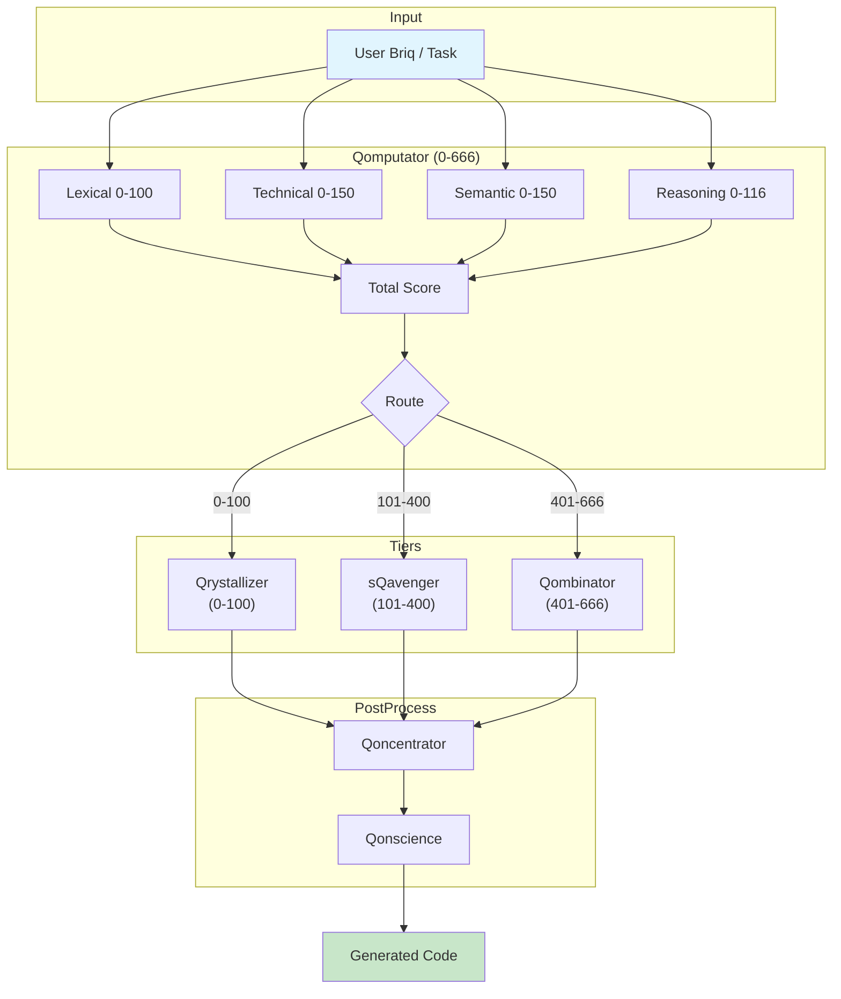
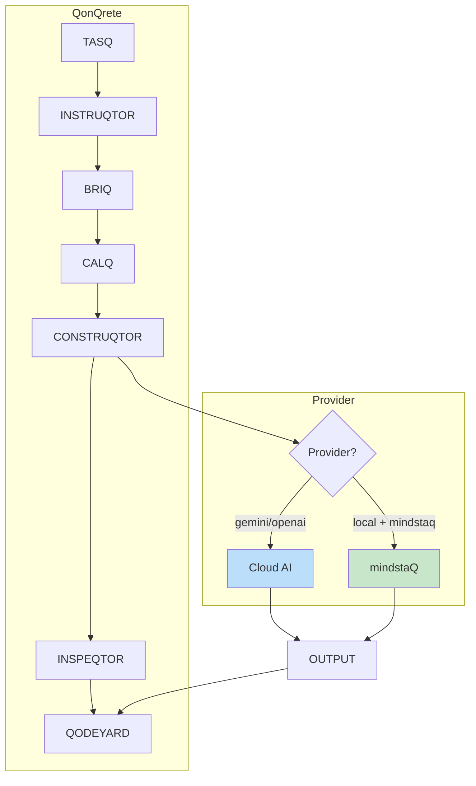

# mindstaQ Architecture

**Version:** 1.0.0  
**QonQrete:** v1.2.3-stable

---

## Master Architecture

```
╔══════════════════════════════════════════════════════════════════════════════╗
║                           mindstaQ MASTER ARCHITECTURE                        ║
╠══════════════════════════════════════════════════════════════════════════════╣
║                                                                              ║
║  ┌─────────────────────────────────────────────────────────────────────────┐ ║
║  │                          USER BRIQ / TASK                               │ ║
║  └───────────────────────────────┬─────────────────────────────────────────┘ ║
║                                  │                                           ║
║                                  ▼                                           ║
║  ┌─────────────────────────────────────────────────────────────────────────┐ ║
║  │                        QOMPUTATOR (worqer/qomputator.py)                │ ║
║  │  SCORING ALGORITHM (0-666 Scale - The Beast Number 😈)                  │ ║
║  │  ├─ Lexical score     [0-100]                                           │ ║
║  │  ├─ Technical score   [0-150]                                           │ ║
║  │  ├─ Semantic score    [0-150]                                           │ ║
║  │  └─ Reasoning score   [0-116]                                           │ ║
║  │                                                                         │ ║
║  │  ROUTING THRESHOLDS:                                                    │ ║
║  │  ├─ 0-100:   TIER 0 → Qrystallizer                                      │ ║
║  │  ├─ 101-400: TIER 1 → sQavenger                                         │ ║
║  │  └─ 401-666: TIER 2 → Qombinator                                        │ ║
║  └───────────────────────────────┬─────────────────────────────────────────┘ ║
║                                  │                                           ║
║         ┌────────────────────────┼────────────────────────────┐              ║
║         ▼                        ▼                            ▼              ║
║  ┌─────────────┐      ┌─────────────────────┐      ┌─────────────────────┐   ║
║  │   TIER 0    │      │       TIER 1        │      │       TIER 2        │   ║
║  │ QRYSTALLIZER│      │      SQAVENGER      │      │     QOMBINATOR      │   ║
║  │  (0-100)    │      │      (101-400)      │      │      (401-666)      │   ║
║  │             │      │                     │      │                     │   ║
║  │ 20+ built-in│      │ Pattern Library     │      │ Multi-source        │   ║
║  │ templates   │      │ + Qrawler (v2.0)    │      │ combination         │   ║
║  │             │      │                     │      │                     │   ║
║  │ ~10-50ms    │      │ ~500ms-2s           │      │ ~2-10s              │   ║
║  └──────┬──────┘      └──────────┬──────────┘      └──────────┬──────────┘   ║
║         │                        │                            │              ║
║         └────────────────────────┴────────────────────────────┘              ║
║                                  │                                           ║
║                                  ▼                                           ║
║  ┌─────────────────────────────────────────────────────────────────────────┐ ║
║  │                   QONCENTRATOR (worqer/qoncentrator.py)                 │ ║
║  │  ├─ AST-based code manipulation                                         │ ║
║  │  ├─ Import resolution                                                   │ ║
║  │  └─ Import sorting (isort-style)                                        │ ║
║  └───────────────────────────────┬─────────────────────────────────────────┘ ║
║                                  │                                           ║
║                                  ▼                                           ║
║  ┌─────────────────────────────────────────────────────────────────────────┐ ║
║  │                     QONSCIENCE (worqer/qonscience.py)                   │ ║
║  │  ├─ Syntax validation                                                   │ ║
║  │  ├─ Import checking                                                     │ ║
║  │  ├─ Linter integration (Ruff)                                           │ ║
║  │  └─ Auto-fix loop (max 5 iterations)                                    │ ║
║  └───────────────────────────────┬─────────────────────────────────────────┘ ║
║                                  │                                           ║
║                                  ▼                                           ║
║  ┌─────────────────────────────────────────────────────────────────────────┐ ║
║  │                            OUTPUT                                        │ ║
║  │  Generated code in markdown format                                      │ ║
║  └─────────────────────────────────────────────────────────────────────────┘ ║
║                                                                              ║
╚══════════════════════════════════════════════════════════════════════════════╝
```

---

## Mermaid Diagram



---

## File Structure

```
qonqrete-localai/
├── worqer/
│   ├── mindstaq/
│   │   └── __init__.py         # MindstaQEngine orchestrator
│   │
│   ├── qomputator.py           # Complexity scoring (0-666)
│   ├── qrystallizer.py         # Template engine (Tier 0)
│   ├── sqavenger.py            # Search harvester (Tier 1)
│   ├── qombinator.py           # Evolutionary synthesis (Tier 2)
│   ├── qoncentrator.py         # AST grafting
│   ├── qonscience.py           # Verification
│   │
│   └── lib_ai.py               # Provider abstraction (includes mindstaq)
│
├── worqspace/
│   └── config.yaml             # mindstaq configuration
│
└── doc/
    ├── MINDSTAQ.md             # User documentation
    └── MINDSTAQ_ARCH.md        # Architecture (this file)
```

---

## Integration



---

*Built for the QonQrete ecosystem* 🔥
